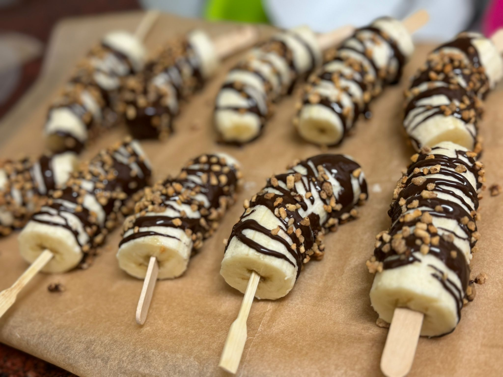

[Back to index](../index.MD)

# Banana Chocolate "Popsicles"

## Ingredients:
- Bananas (cut into halves or thirds)
- Dark chocolate (melted)
- Toppings: candied hazelnuts, toasted coconut, or sprinkles
- Small popsicle sticks

## Instructions:
1. Melt the chocolate in the microwave.
2. Insert sticks into the bananas, drizzle with melted chocolate, and add toppings (though they're delicious even without).
3. Place on parchment paper and freeze for 30 minutes.
4. Transfer to a bag and store in the freezer.

