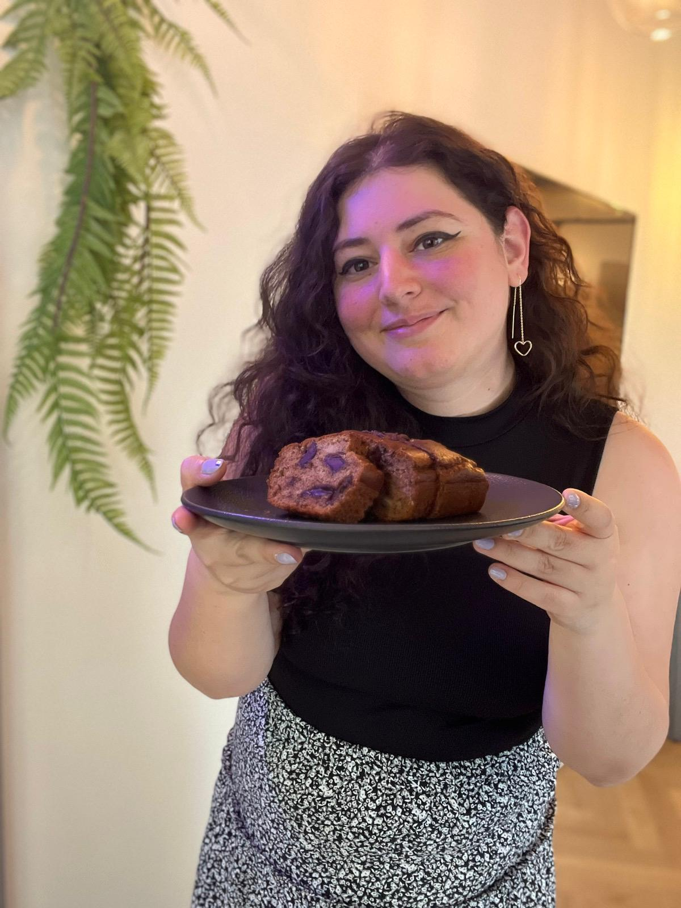
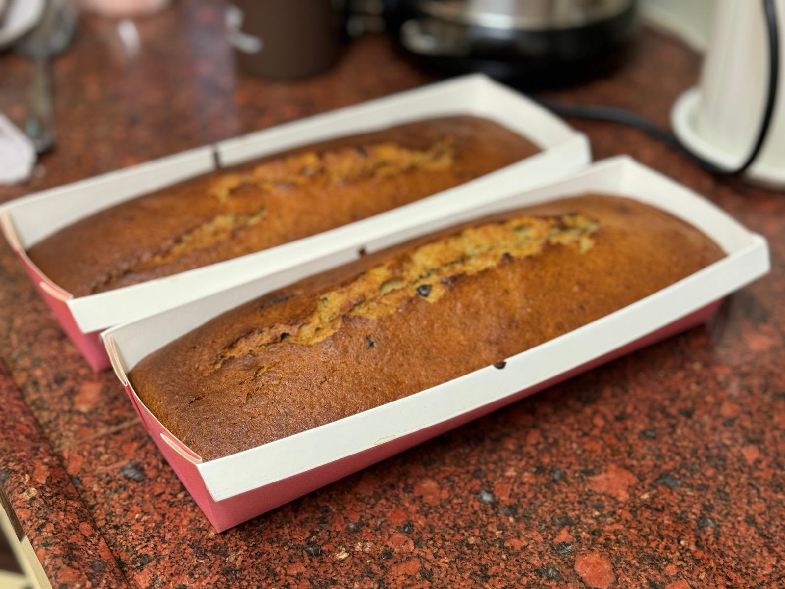

[Back to Menu](../index.MD)

2 English cake pans, 25 cm long

# For the Cake:
* 100g (1 cup) sugar
* 115g (1/2 cup) oil
* 3 large eggs (see notes for vegan version)
* 1 teaspoon vanilla extract
* A pinch of salt
* 3 mashed bananas (about 300g)
* 210g (1.5 cups) flour (see notes for gluten-free version)
* 10g (2 teaspoons) baking powder
* 200g chopped dark chocolate

# Instructions:
1. Preheat the oven to 170°C (340°F) and grease the pans well.
2. In a bowl, whisk together sugar, oil, eggs, vanilla, salt, and mashed bananas until smooth.
3. Add flour and baking powder and mix well until just combined.
4. Chop the chocolate and add it to the mixture. Gently fold for even distribution.
5. Pour the mixture into the pans and smooth the top.
6. Bake for 30-40 minutes or until the cakes are golden, set, and a toothpick inserted in the center comes out with moist crumbs.
7. Let cool completely at room temperature and serve.

# Double Recipe

* 200g (2 cups) sugar
* 230g (1 cup) oil
* 6 large eggs (see notes for vegan version)
* 2 teaspoons vanilla extract
* A pinch of salt
* 6 mashed bananas (about 600g)
* 420g (1.5 cups) flour (see notes for gluten-free version)
* 20g (4 teaspoons) baking powder
* 400g chopped dark chocolate

 ★ | ★ 
:--:|:--:
 | 
