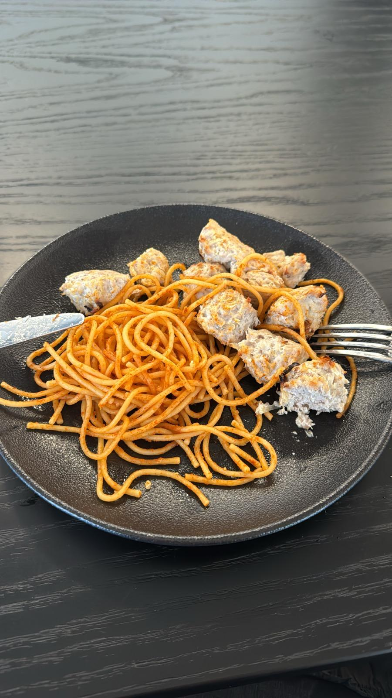

[Back to index](../index.MD)

# Quick Chicken Meatballs by Sash

## Ingredients:
- 1 kg ground chicken breast
- 1 kg ground chicken thighs
- 1 kg finely chopped onion
- 26g Salt
- black pepper, granulated garlic, cayenne pepper - to taste (also works with [grill rub](grill_rub.MD))

this amount fills 2 oven trays. they freeze well, and reheat well in microwave or oven.

## Instructions:
1. Mix all the ingredients together using your hands (it's recommended to wear gloves).
2. Preheat the oven to 230°C in turbo mode.
3. Form balls from the mixture (using a meatball maker is recommended).
4. Space the meatballs apart to allow room for oven air to circulate get a more even roast.
5. Place in the preheated oven and bake for 10-15 minutes until the edges start to brown.

You can buy the meatball maker [here](https://a.aliexpress.com/_oD9yzu5).

| ★               | ★               |
|:---------------:|:---------------:|
|  |  |
