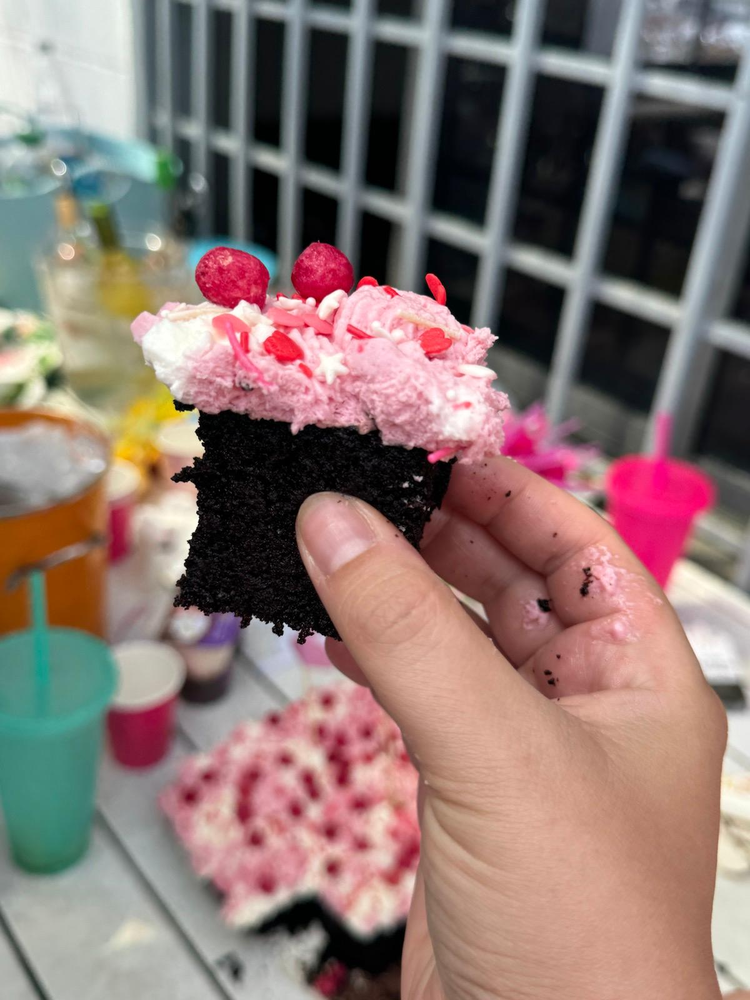

[Back to Menu](../index.MD)

## Round Cake Pan 22 cm

### For the Cake:
* 3 large eggs at room temperature
* 200 grams (1 cup) sugar
* A pinch of salt
* 125 ml (1/2 cup) refined olive oil
* 125 ml (1/2 cup) water
* 150 grams (1.5 cups) almond flour
* 70 grams (1/2 cup) cocoa powder
* 1/2 teaspoon baking soda

### For the Ganache:
* 100 grams dark chocolate
* 125 ml (1/2 container) heavy cream or coconut cream

### For Decoration:
* Crushed caramelized hazelnuts (bress)

### Instructions:
1. Preheat the oven to 160°C (without turbo) and grease the pan well.
2. In a mixer bowl, whisk the eggs, sugar, and salt at high speed until a fluffy, light, and airy mixture forms.
3. Reduce the mixing speed and gradually add the oil in a thin stream while slowly mixing until fully incorporated.
4. Gradually add the water and continue mixing until fully combined.
5. Add the almond flour, cocoa powder, and baking soda, mixing only until just combined.
6. Pour the batter into the pan and bake for 35-45 minutes or until the cake has risen, the edges are set, and it springs back when touched.
7. Let cool at room temperature. The cake will slightly sink in the center during cooling, which is normal.
8. **Chocolate Ganache:** Chop the chocolate and place it in a bowl. Add the cream and melt together in the microwave or over a double boiler until everything is melted and the mixture is smooth.
9. Pour the ganache over the cake, allowing it to drip down the sides.
10. Cool the cake in the refrigerator for 2-3 hours until the ganache is fully set.
11. Remove from the pan and decorate with crushed hazelnuts.
12. Serve the cake at room temperature.

### For Half the Cake:
* 1.5 large eggs at room temperature (100 grams whisked eggs)
* 100 grams (1/2 cup) sugar
* A pinch of salt
* 57 grams (1/4 cup) refined olive oil
* 63 grams (1/4 cup) water
* 75 grams (3/4 cup) almond flour
* 35 grams (1/4 cup) cocoa powder
* 1/4 teaspoon baking soda

 ★ | ★ 
:--:|:--:
 | 
