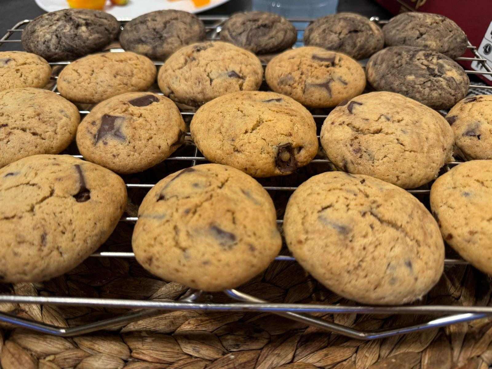

## Ingredients:
- 100g soft butter (or 80g coconut oil for lactose-free)
- 100g dark brown sugar
- 3g salt (1/2 tsp)
- 5g vanilla extract (1 tsp)
- 1 large egg
- 1.5g baking soda (1/4 tsp)
- 2.5g baking powder (1/2 tsp)
- 210g flour
- 200g chopped dark chocolate or chocolate chips

## Instructions:
1. Preheat the oven to 170°C.
2. In a mixer bowl with a paddle attachment (or a hand mixer), beat butter, sugar, salt, and vanilla on high speed until creamy.
3. Add the egg and mix until incorporated.
4. Add baking soda, baking powder, and flour, mixing until large dough clumps form.
5. Fold in chocolate chips (or chopped chocolate). if chopped chocolate, keep part aside for later.
6. Form 10-12 dough balls and place on a lined baking tray. Top with the extra chocolate.
7. Bake for 12-17 minutes until golden. Cool slightly before serving.
8. let cool to room temperature before serving.
