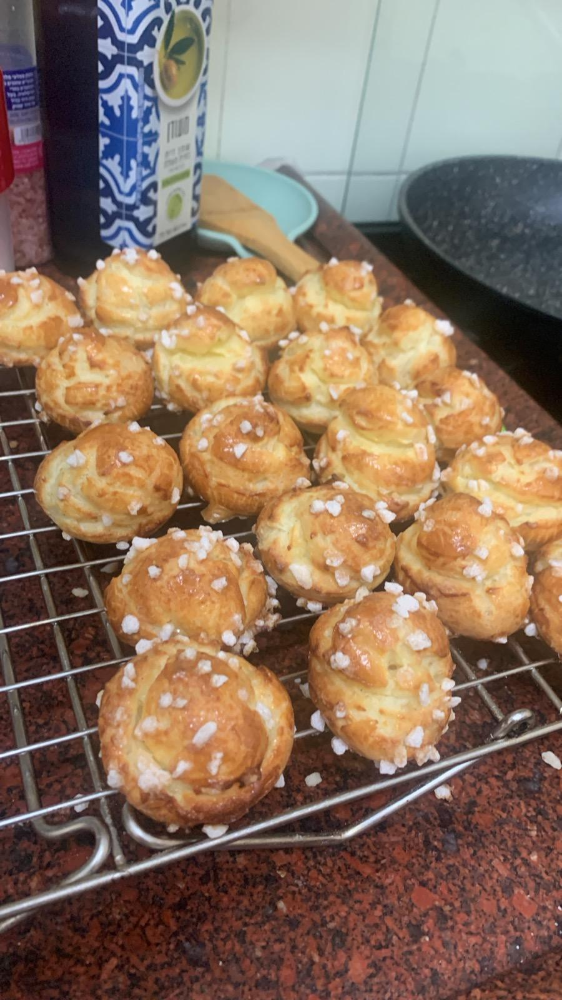

[Back to index](../index.MD)

# Shouquettes

## Ingredients for x1 batch (makes 10-15 pieces)
- 60g milk
- 16g butter
- A small pinch of salt
- 30g all-purpose flour
- ½ teaspoon vanilla extract
- 1 large egg

## Ingredients for x2 batch (makes 20-25 pieces)
- 120g milk
- 32g butter
- A medium pinch of salt
- 60g all-purpose flour
- 1 teaspoon vanilla extract
- 2 large eggs

## Ingredients for x3 batch (makes 30-40 pieces)
- 180g milk
- 50g butter
- A pinch of salt
- 90g all-purpose flour
- 1 teaspoon vanilla extract
- 3 large eggs

## Instructions:
1. Place the milk and butter in a small saucepan and prepare the flour and salt in a bowl on the side.
2. Bring the milk and butter to a boil, then immediately turn off the heat.
3. Stir in the flour with a flat wooden spoon until the mixture forms a grainy but cohesive dough.
4. Let the mixture cool (about 10 minutes in the freezer if you're in a hurry).
5. Preheat the oven to 180°C (fan setting).
6. Transfer the dough to a food processor, pulse a few times, and add the vanilla extract.
7. Add the eggs one at a time, mixing between each addition until the mixture is smooth.
8. Transfer the dough to a piping bag and pipe small round mounds onto a baking tray lined with parchment paper (they will puff up a lot, so make sure they're round, not kiss-shaped).
9. Generously sprinkle crystal sugar on top and bake for 30-35 minutes, until the tops are golden brown.

