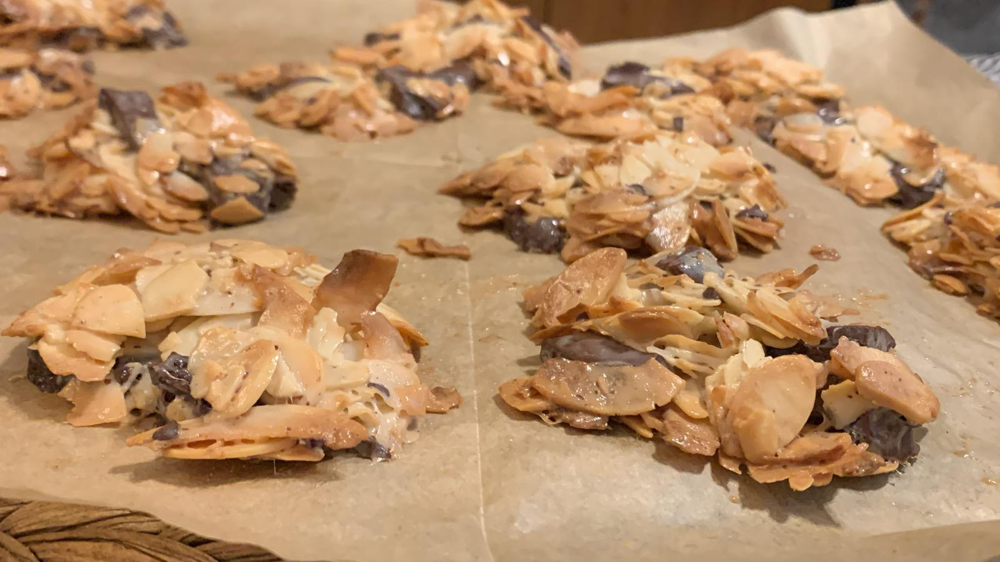
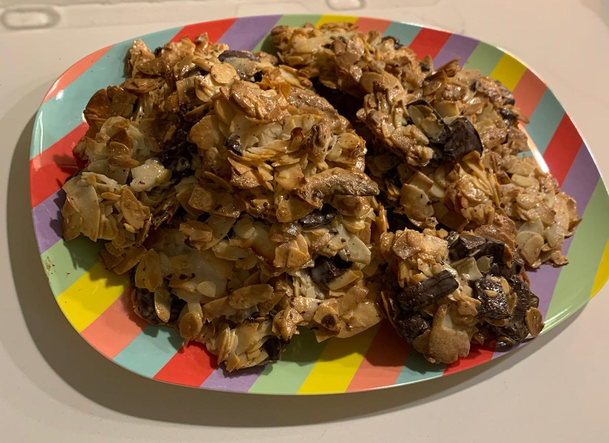

[Back to index](../index.MD)

# Coconut Chocolate Almond Cookies

## Ingredients grams:
- 100g Sliced almonds
- 100g Roasted coconut
- 100g Dark chocolate (chopped or chips)
- 1 can (400g) Coconut condensed milk

## Instructions:
1. Preheat oven to 180°C. Line a baking sheet with parchment paper.
2. Mix all ingredients in a bowl.
3. Scoop small portions onto the baking sheet.
4. Bake for 10 minutes or until toasted.
5. Cool on a wire rack.

 ★ | ★ 
:--:|:--:
 | 
