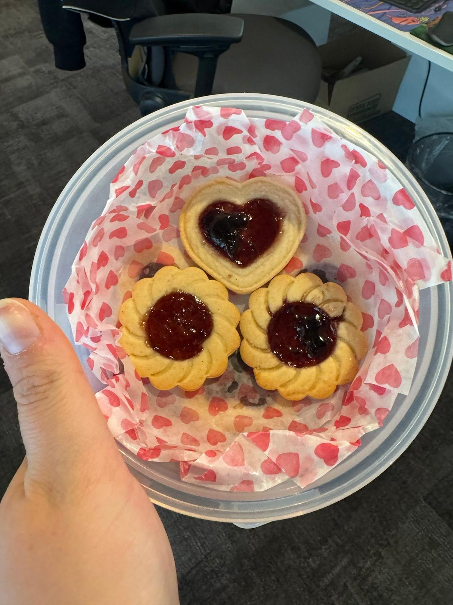

[Back to Menu](../index.MD)

# Cookie Shapes
## What You Need
* 100 grams of softened butter
* 1 egg
* ½ cup white sugar (100 grams)
* ½ teaspoon vanilla extract or 1 teaspoon essence
* 2 cups all-purpose flour (280 grams) or other flour
* ⅓ teaspoon salt (do not skip!)

## Instructions
1. In a large bowl, place the butter, egg, sugar, and vanilla and mix with a wooden spoon until smooth. This may take about two minutes; you can use a whisk if needed.
2. Add the flour and salt and continue mixing well.
3. When the dough forms, continue with your hands to shape it into a unified ball (do not overwork it).
4. Transfer the ball to a plastic bag and refrigerate for half an hour to 24 hours (if refrigerated for more than an hour, let the dough warm slightly on the counter before rolling out).
5. Turn on the air conditioning (do not work in a hot room).
6. Preheat the oven to 170 degrees Celsius and line baking sheets with parchment paper.
7. Roll out the dough:
   * Remove the dough from the bag and place it on a lightly floured surface.
   * The best way to work (as with any shortcrust pastry) is to rotate/move the dough slightly on the surface after each rolling. This way, the dough won't stick to the work surface, and you can also flour it a bit more from time to time.
   * If you're working with children, divide the dough into four parts.
   * Roll out to a thickness of 4-5 mm (not too thin).
   * Cut out the desired shapes and place them with minimal spacing on the parchment paper.
   * Gather the leftover dough, knead it a bit, and roll it out again (and cut out again). There's no need to waste any dough in the process.
   * You can decorate with sprinkles at this stage.
8. Bake for 10-15 minutes (depending on your oven) until the cookies are slightly golden but still light in color.
9. Let cool completely and store in an airtight container.

## Notes
- You can replace 2 tablespoons of flour with 2 tablespoons of cocoa for darker, chocolatey cookies. In this case, add a teaspoon of sugar.
- If the dough crumbles and does not come together, add a tablespoon of softened butter or a teaspoon or two of cold milk or water :)
- It's more challenging to make shortcrust pastry with spelt flour – it's possible but more difficult.

 ★ | ★ 
:--:|:--:
 | 
