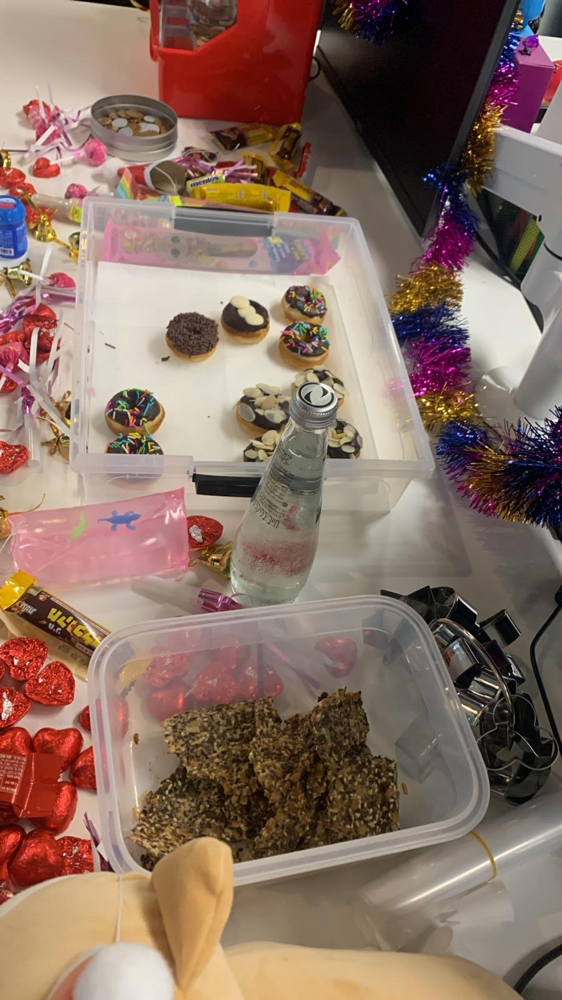

[Back to index](../index.MD)

# Seed and Nut Crackers

## Dry Ingredients:
- 120g sunflower seeds
- 120g flax seeds
- 60g chia seeds
- 40g pumpkin seeds
- 50g sesame seeds
- 70g cornflour
- 2 teaspoons white sugar
- 1½ teaspoons fine salt
- ¾ teaspoon ground black pepper

## Wet Ingredients:
- 1½ cups (375ml) boiling water
- 53g olive oil
- 2 tablespoons raw tahini (whole or regular)

## Instructions:
1. Mix all the dry ingredients in a medium bowl.
2. In another bowl, mix all the wet ingredients.
3. Pour the wet ingredients over the dry ingredients and stir vigorously for 1 minute. The mixture will be liquid.
4. Preheat the oven to 160°C.
5. Line a flat baking sheet with parchment paper and pour half the mixture into the tray (half the mixture should weigh 450g). Flatten the mixture well using another sheet of parchment paper. It’s recommended to spread it as thin as possible, even if you need to use more than one tray.
6. Bake for 45 minutes (after 25 minutes, it's recommended to rotate the tray for even baking).
7. Remove from the oven, place the cracker on a countertop, and line the same tray with new parchment paper.
8. Add 2-3 tablespoons of boiling water to the remaining mixture in the bowl, stir well, and pour into the tray. Flatten well and put it immediately in the oven for another bake. Bake for 40 minutes, rotating the tray after 20 minutes. The second baking time is reduced by 5 minutes.
9. Cool completely and break into desired-sized pieces.

