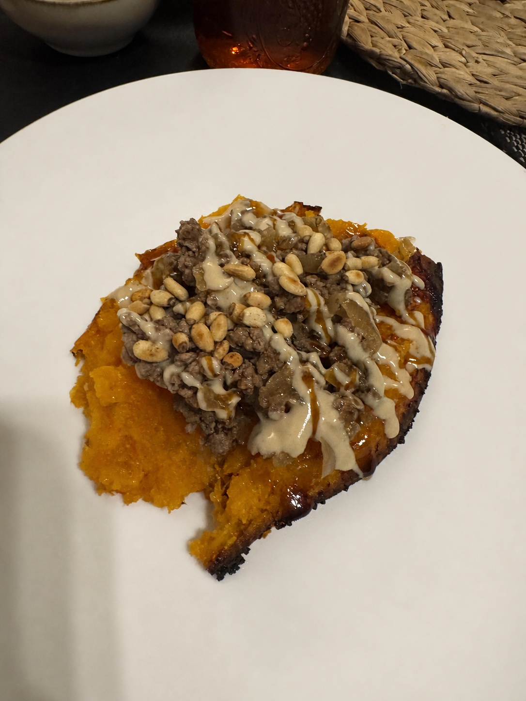

[Back to Menu](../index.MD)

# Ground Beef over Roasted Sweet Potato

## Ingredients

- 1 kg center-cut shoulder (Israeli cut no. 4), ground
- 3 onions
- Granulated garlic, salt, black pepper, and ground cinnamon
- Large sweet potatoes, as many as desired
- Tahini
- Silan (date syrup)
- Pine nuts or sliced almonds
- Olive oil

## Instructions

1. Preheat the oven to 220°C (425°F) on the fan setting. Line a baking sheet with parchment paper and spread olive oil over it.
2. Halve the sweet potatoes lengthwise, dip the cut sides in the oil on the parchment, and sprinkle them with salt.
3. Place the sweet potatoes cut-side down and roast for about 45 minutes, or until tender and beginning to char.
4. Meanwhile, chop the onions and fry them until caramelized. Transfer them to a bowl and set aside.
5. Fry the ground beef in small batches so it browns well. Season with granulated garlic, salt, black pepper, and ground cinnamon.
6. Combine the browned beef and caramelized onions in the bowl.
7. Toast the pine nuts or sliced almonds in a dry pan until golden.
8. Place the roasted sweet potatoes on a plate and spoon the beef and onion mixture over them. Drizzle with tahini and a little silan, then finish with the toasted pine nuts or almonds.

