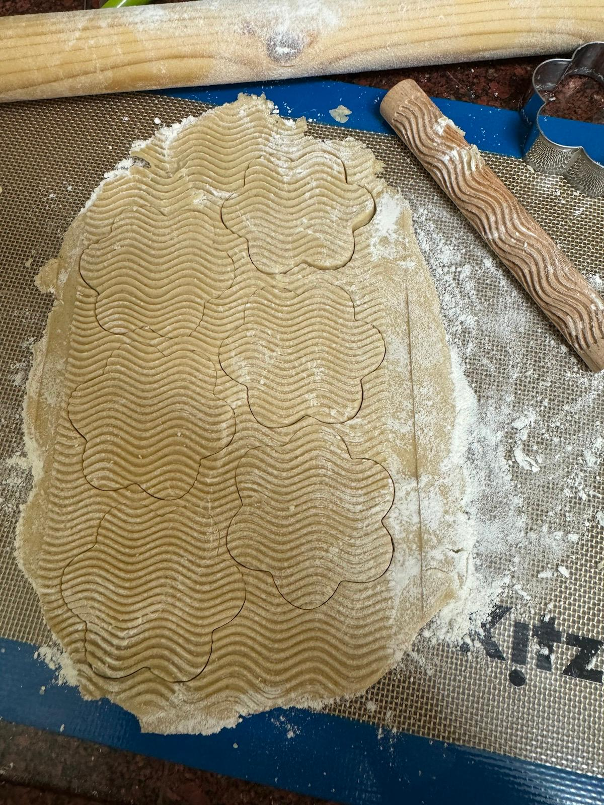
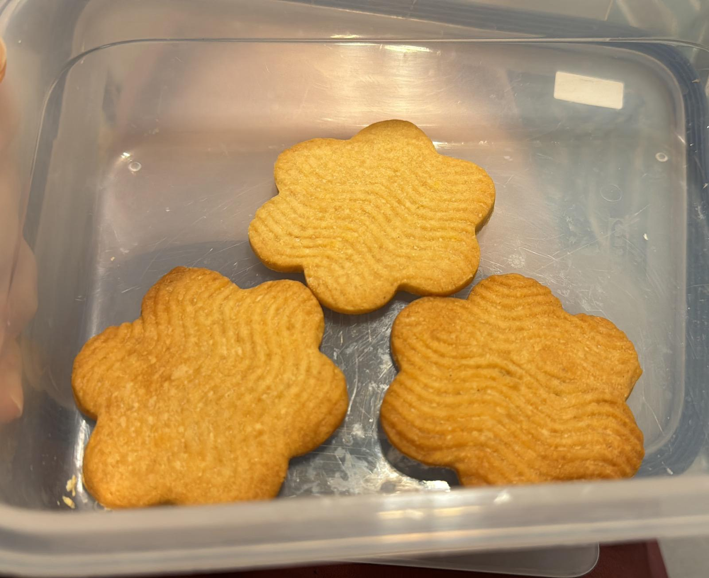

# Honey sugar cookies

## Ingredients:
- 227g unsalted butter, softened (2 sticks)
- 100g sugar
- 60ml honey
- 5ml vanilla bean paste (see note)
- Pinch of salt
- 400g flour

## Instructions:
1. In the bowl of a stand mixer, cream butter and sugar. Scrape down the sides of the bowl.
2. Add honey, vanilla bean paste, and salt. Mix to combine. Scrape down the sides of the bowl.
3. Gradually add flour, mixing just until the mixture starts to come together.
4. Form dough into a disc, wrap in plastic, and refrigerate until firm, at least one hour.
5. Preheat oven to 350°F. Line baking sheets with silpats or parchment. Set aside.
6. After chilling, roll dough to about ¼" thickness on a well-floured surface. Cut out desired shapes and place on prepared baking sheets.
7. Chill cut shapes in the refrigerator for 10 minutes prior to baking to help retain their shape.
8. Bake for 7-10 minutes, or until bottoms are slightly golden. Allow to cool on the pan for at least 10 minutes before transferring to a wire rack to cool completely.

 ★ | ★ 
:--:|:--:
 | 