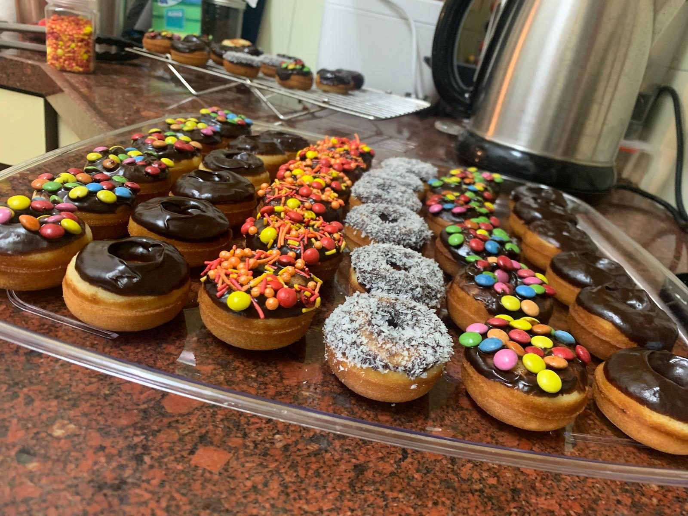

# Pancake batter
## Ingredients
* 1 Large egg
* 180 g Milk
* 50 g Granulated sugar
* 50 g Melted butter
* 1 tsp Vanilla extract
* 180 g AP flour
* 1 tsp Baking powder
* 1 pinch Salt

## for creating doughnuts in multi cake

- 5 minute bake in multi cake
- Produces 18 doughnuts

## chocolate ganache glaze
60 g Dark baking chocolate melted in microwave with a couple of tablespoons of milk
 ★ | ★ 
:--:|:--:
 | 