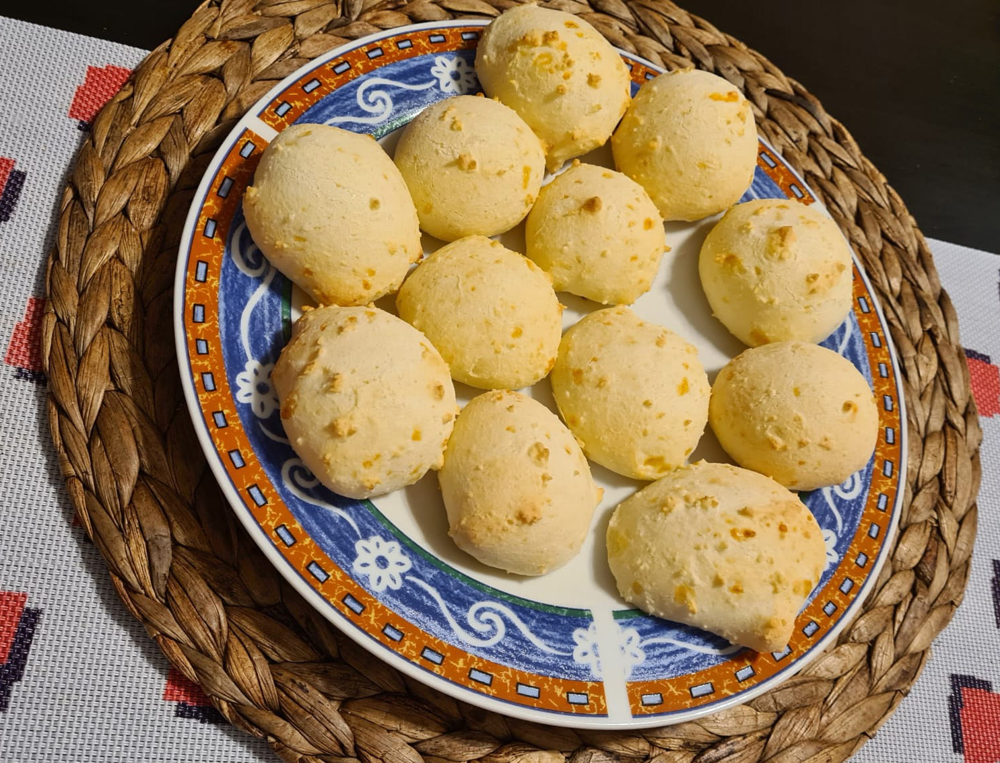

[Back to index](../index.MD)

# pão de queijo:
## Ingredients

* 160g tapioca flour, plus more as needed to adjust texture
* 30g  lightly flavored olive oil and/or vegetable oil
* 100g  milk
* 40g  freshly grated mozzarella
* 30g  freshly and finely grated Parmigiano-Reggiano
* 3g   salt
* 1    large beaten egg

# instructions
* Preheat oven to 200C
* Heat milk+oil to milk boil point, fork-mix with flour until lumpy but incorporated, let rest 5 min.
* Add all other ingredients and mix well to a soft sticky dough, ice-cream scoop to baking parchment.
* Bake for 20 min, or until golden (not brown).

