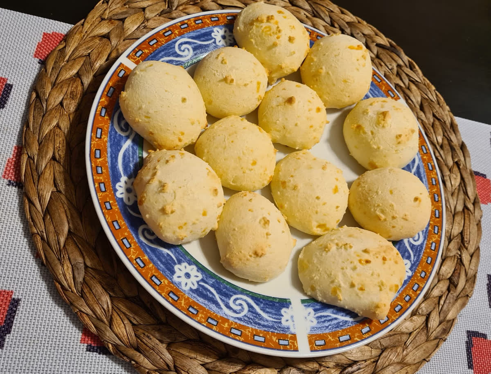

[Back to Menu](../index.MD)

# Pão de queijo:

## Ingredients

### For the first part

- 100g Milk
- 30g Lightly flavored olive oil and/or vegetable oil
- 3g Salt
- 160g Tapioca flour, plus more as needed to adjust texture

### For the second part

- 1 Large beaten egg
- 40g Freshly grated low moisture mozzarella
- 30g Finely grated parmesan (or pecorino)

## Instructions

- Preheat oven to 200C
- Heat milk+oil+salt to milk boil point, fork-mix in the flour until lumpy but incorporated, let rest 5 min (to cool before mixing with eggs).
- Add all other ingredients and mix well to a soft sticky dough, ice-cream scoop to baking parchment.
- Bake (fan off) for 20 min, or until golden (not brown).

