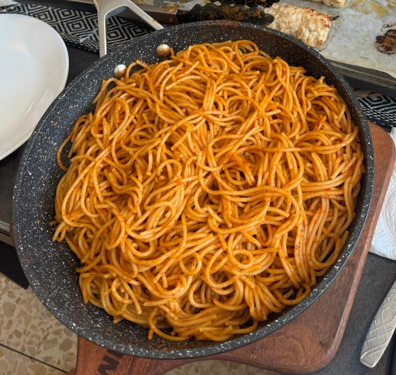

[Back to Menu](../index.MD)

# Pasta Paprikash

## Ingredients:

- Half a pack of spaghetti (thin pasta recommended)
- Olive oil
- 2 heaping teaspoons sweet paprika
- 120 g tomato concentrate (22° Brix)
- Granulated garlic
- Sugar, about 4 g, plus more to taste
- Salt and pepper to taste
- Cayenne pepper or hot paprika (optional)

## Instructions:

1. Start cooking the pasta in lightly salted boiling water. Use less salt than you would if draining the pasta, since some pasta water will enter the sauce and concentrate as it cooks.
2. While the pasta cooks, heat a little olive oil in another pot.
3. Add sweet paprika, tomato concentrate, granulated garlic, about 4 g sugar, and pepper. Optionally, add cayenne pepper or hot paprika for a spicy kick.
4. Cook down the tomato concentrate, stirring to develop the flavors.
5. About 2 minutes before the packet's stated al dente time, transfer the pasta directly into the sauce with tongs, letting the water clinging to the pasta enter the sauce.
6. Start tasting the pasta with the sauce as soon as you have added it. Finish cooking in the sauce, tossing with tongs. If the pasta is still firm and the sauce is too dry, ladle in a little pasta water at a time; this adds both moisture and salt.
7. If the pasta is already al dente and needs more salt, add plain salt without adding more water. If the flavor feels flat, try adding a little more sugar to taste.

## Note:

For a full pack of pasta, double the amount of sweet paprika, but 120 g tomato concentrate should suffice. You can use 240 g for a thicker texture.

