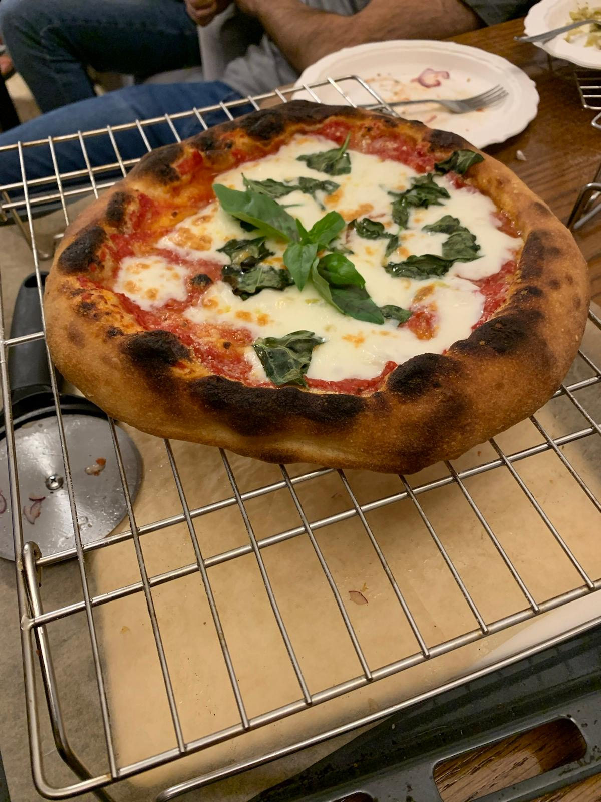
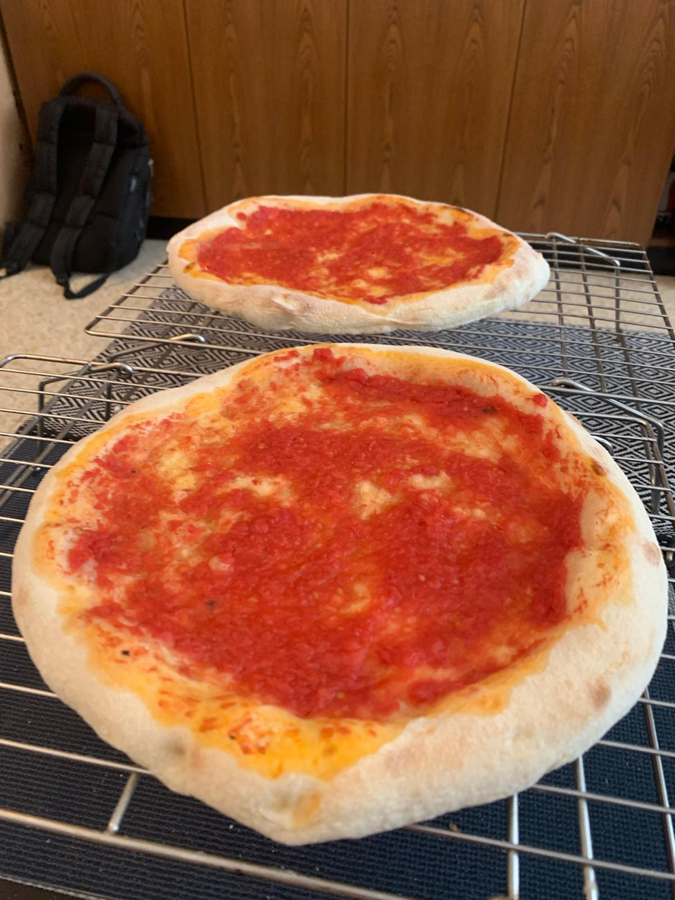
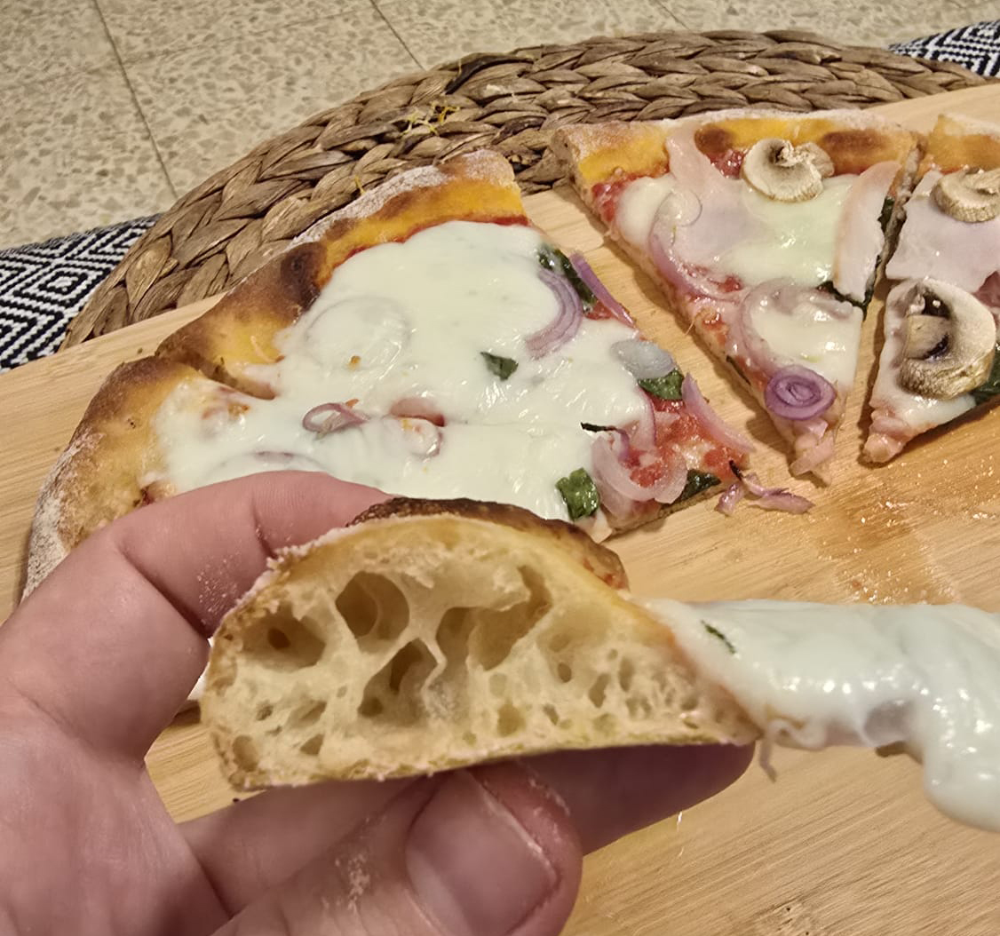

[Back to index](../index.MD)

# Pizza Dough Recipe
1. Unfortunately the original calculator seems to be down [poolish calculator](https://ggalmazor.com/bread_making/poolish_recipe_calculator.html)
2. Fortunately I copied the logic to a bash script before it went down [poolish bash script](../poolish_calc.sh)

## Overall

## Recipe for 566g of dough, 2 12-inch pizzas of 283g each
Desired dough weight: 566g
Desired dough hydration: 70%

## Poolish
Poolish percentage: 67%
Hydration percentage: 100%
Poolish yeast percentage: 1.4%

## Rest of Dough
Salt percentage: 2.7%
Yeast percentage for the rest: 0%

## Ingredients
Total flour: 333g
Total water: 233g

Poolish flour: 223g  
Poolish water: 223g  
Poolish yeast: 3g
Poolish honey: 3g

Rest of flour: 110g  
Rest of water: 10g  
Salt: 9g

## Instructions

### Vito Iacopelli's Overnight Poolish Neapolitan Pizza Method

1. **Poolish Preparation (the night before)**:
 - Mix the poolish ingredients (flour, water, yeast, and honey) until well combined.
 - Let the mixture rest at room temperature for 1 hour.
 - After 1 hour, cover and refrigerate overnight (12-18 hours).

2. **Dough Preparation (next day)**:
 - Mix the poolish with the remaining flour, water, and salt.
 - Knead the dough until smooth and elastic, about 10-15 minutes.
 - Let the dough rest for 1-2 hours at room temperature.

3. **Preheat the Oven**:
 - Preheat the oven to its highest temperature with a pizza stone or steel inside.
 - preheat for at least 1 hour to ensure the stone or steel is fully heated.

3. **Shaping**:
 - Divide and shape the dough into individual balls (around 283g each).
 - into individual olive oiled bowls, cover, and let rest for 1-3 hours at room temperature. until doubled in size. 

4. **Stretching**:
 - empty one risen dough ball from the oiled container into a wide bowl with a half-and-half mix of 00 flour and semolina.
 - make sure the dough is well coated with the flour mix.
 - take the dough ball out onto a lightly floured surface and gently stretch it into a 12-inch pizza shape.
 - make sure the dough is not too thin in the center, and the edges are slightly thicker.
 - start from the center and work your way outwards, leaving a 1-inch border around the edge.
 - work with a flat fingers to avoid pressing a finger through the dough.

5. **Par-baking**:
 - Sprinkle some of your flour mix on the pizza peel to prevent sticking.
 - Transfer the stretched dough to the pizza peel.
 - From here working quickly as to not let the dough stick to the peel.
 - Apply a thin layer (3-4 tablespoons) of tomato sauce (Mutti crashed tomatoes with salt to taste and a dash of olive oil) to the stretched dough.
 - Shake the peel to make sure the pizza is not sticking.
 - Slide the pizza onto the preheated stone or steel.
 - Bake the pizza for a few minutes until the crust is set (but not yet started to brown) and the tomato sauce is partially cooked (about 4-5 minutes).

6. **Topping and Final Bake**:
 - Remove the pizza from the oven onto a cooling rack
 - Here you may consider par-baking any additional pizza doughs you have. 
 - To one of the par-baked pizzas add your basil leaves, grated parmigiana, dry mozzarella and any other toppings.
 - For a darker crispier crust, you may consider adding a drizzle of olive oil to the edge of the crust.
 - Return the pizza to the oven and bake until the cheese is melted and the crust is fully cooked (about 4-5 more minutes).

7. **Finishing**:
 - Once baked, remove the pizza from the oven, back to a cooling rack, let it cool briefly before serving.

|            ★                    |              ★                      |
|:-------------------------------:|:-----------------------------------:|
|    |  |
|  |                                     |
