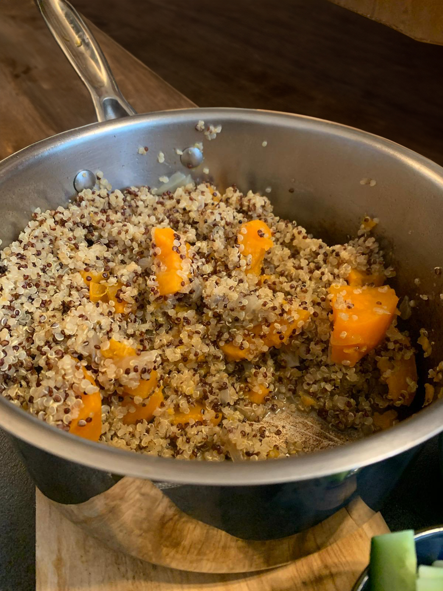

[Back to Menu](../index.MD)

# Delicious Quinoa with Sweet Potato
## Ingredients
* Olive oil
* Onion
* Quinoa
* Sweet potato
* Salt
* Garlic granules

## Instructions
Chop the onion and sauté until cooked.
Add the quinoa and stir with the oil and onion to lightly toast it. Add salt (about two teaspoons, as the sweet potato absorbs the salt) and garlic granules (the garlic is optional).
Cut the sweet potatoes into thick slices and then into quarters, mixing them with everything else.
Add twice the amount of water as quinoa, plus an additional quarter cup for the sweet potatoes.
Bring the pot to a boil, reduce to low heat, and cover for 15 minutes. After 15 minutes, turn off the heat and leave covered for 10 more minutes, then open and stir.

