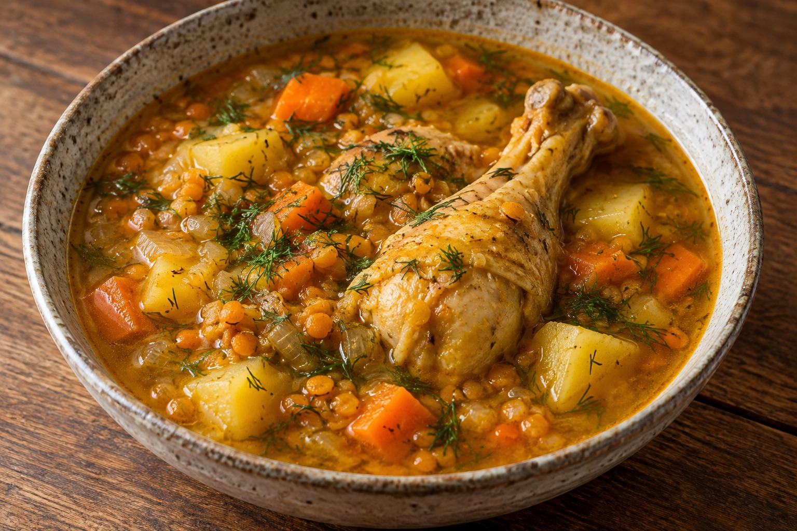

[Back to Menu](../index.MD)

# Rustic Chicken Soup with Red Lentils and Potatoes

## Ingredients

- 6 whole chicken drumsticks (about 1–1.2 kg)
- 2 large onions (about 400 g), chopped
- 2 garlic cloves (about 10 g), crushed
- 2 carrots (about 200 g), diced
- 250–500 g potatoes, diced
- 150 g red lentils
- 2 liters water
- 6 g hawaij for soup (2 teaspoons)
- 1.5 g ground turmeric (½ teaspoon)
- 40 g olive oil (3 tablespoons)
- Salt and black pepper to taste
- 20–25 g fresh dill, chopped, optional

## Instructions

1. Heat the olive oil in a large pot. Add the whole chicken drumsticks and sear for a few minutes on each side, until lightly browned. Transfer to a plate.
2. Add the carrots and potatoes to the same pot and cook until lightly browned. Transfer them to the plate with the chicken.
3. Add the onions to the pot and cook for a few minutes, until they begin to turn golden. Return the carrots and potatoes to the pot.
4. Add the garlic, hawaij, and turmeric. Stir with the vegetables for about 30 seconds.
5. Return the drumsticks to the pot, add the water, and season with salt and pepper. Bring to a boil, reduce to medium-low heat, partially cover, and simmer for about 30 minutes.
6. Rinse the red lentils thoroughly, add them to the pot, and cook for another 15–20 minutes, until the lentils are tender and the chicken is cooked through.
7. If using dill, stir it in during the final 5 minutes of cooking.

