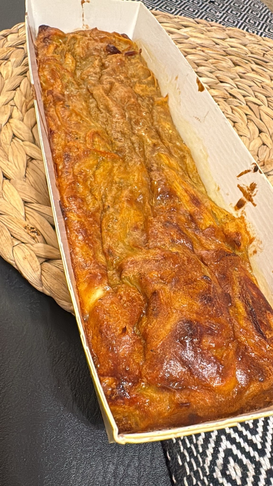

[Back to Menu](../index.MD)

# Sweet Potato Bake

Makes one muffin tin or 2 loaf pans.

## Ingredients

- 1 large sweet potato, about 500g after peeling
- 2 large onions, about 400g after peeling
- 6 large eggs, about 300g without shells
- 70g whole-wheat or white self-rising flour
- 4g baking powder
- 55g olive oil
- 5g salt
- 0.2g black pepper
- 0.3g garlic powder
- 0.3g ground cinnamon

## Instructions

1. Preheat the oven to 180°C (355°F) on the fan setting. Grease a muffin tin or 2 loaf pans.
2. Cut the sweet potato into julienne strips with a julienne peeler and finely chop the onions.
3. Heat a small amount of the olive oil in a frying pan and sauté the onions until golden.
4. Add the sweet potato strips and stir until they soften slightly.
5. Transfer the onions and sweet potato to a bowl and let the mixture cool slightly.
6. Add the eggs, flour, baking powder, remaining olive oil, and seasonings. Mix well.
7. Pour into the prepared pan or pans and bake for 30-35 minutes, until golden and set in the center.

## Note

The small spice weights are approximate; adjust them to taste.

