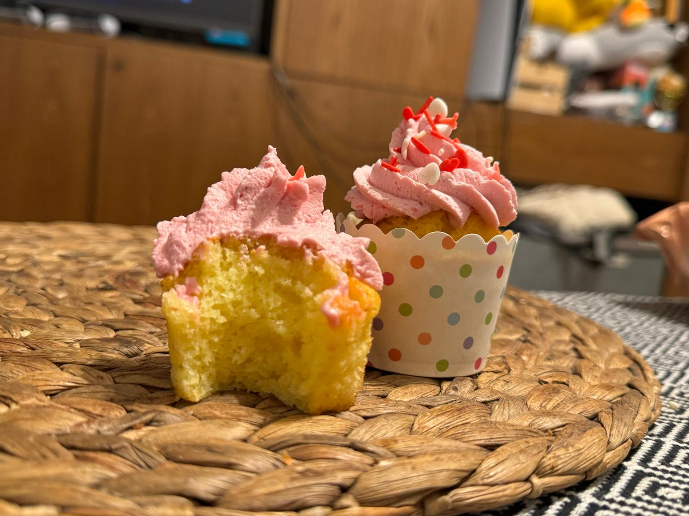

[Back to index](../index.MD)

# Vanilla Cupcake Recipe (White Cake)
[עברית](./vanila_cupcakes.he.MD)

## Ingredients (8-10 cupcakes):
- 1 large egg (or 2 small eggs)
- 100g sugar (1/2 cup)
- 80ml vegetable oil (1/3 cup)
- 160ml orange juice (2/3 cup, can use bottled juice)
- 1/2 tsp vanilla extract
- 140g self-raising flour (1 cup, or 1 cup plain flour + 1 tsp baking powder)

## Instructions:
1. Mix all ingredients with a whisk or spoon in the order listed.
2. Pour into a muffin tin.
3. Bake in a preheated oven at 180°C for about 15 minutes.

