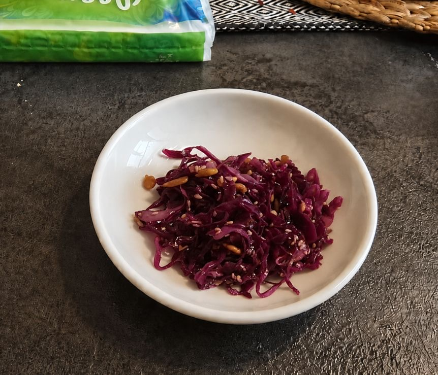

[חזרה לתפריט](../index.MD)

# סלט כרוב עם רוטב סויה של אמא של סש

## מצרכים

- כ־1 ק״ג כרוב (בכל צבע), חתוך לרצועות דקות

### לרוטב:

- 110 גרם שמן צמחי בטעם ניטרלי (זרעי ענבים/קנולה/אחר)
- 140 גרם סויה בסגנון יפני (קיקומן/יאמאסה)
- 38 גרם סוכר
- 3 גרם מלח

- 100 גרם צנובר
- 100 גרם שומשום לבן
- 100 גרם גרעיני חמנייה קלופים

## אופן הכנה:

1. בשייקר מערבבים היטב את כל רכיבי הרוטב, ומזלפים מעל הכרוב ומערבבים היטב. מניחים לפחות לרבע שעה במקרר לפני ההגשה, הטעמים משתפרים עם הזמן ניתן להכין כמה שעות מראש.
2. במחבת נון-סטיק יבשה מטגנים את השומשום, גרעיני החמנייה בנפרד, ואת הצנובר בנפרד עד שכולם מתחילים להשחים ולהריח. מפזרים על צלחת שטוחה לקירור.
3. לפני ההגשה מערבבים הכל עם הצנוברים, שומשום וגרעינים.

