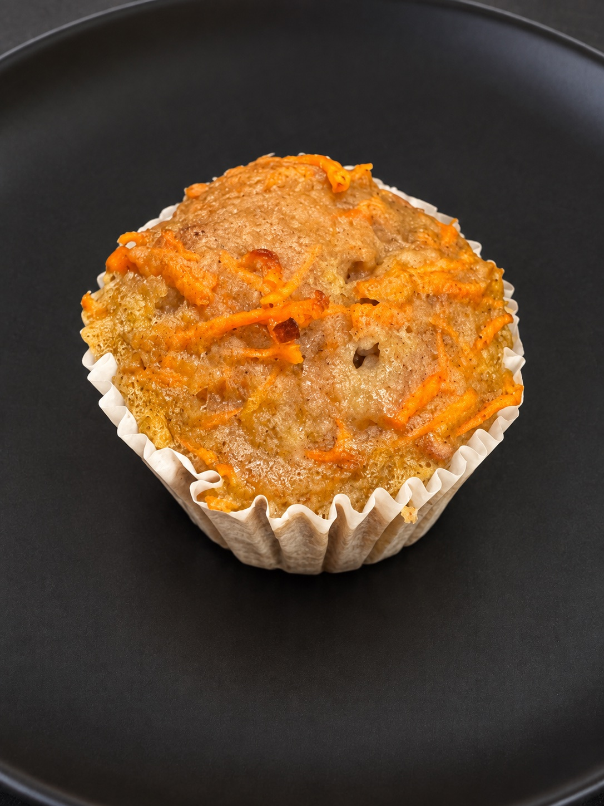

[חזרה לתפריט](../index.MD)

# מאפינס או עוגת גזר מתוקה וקלה

**16 מאפינס או עוגת אינגליש קייק אחת | 4 מנות**

## מצרכים

- 300 גרם גזר, מגורר דק
- 6 ביצים
- 113 גרם רסק תפוחים בתוספת סוכר
- 25 גרם מייפל
- 20 גרם שמן
- 5 גרם תמצית וניל
- 120 גרם קמח לבן תופח
- 1–2 גרם קינמון
- קורט מלח

## אופן ההכנה

1. מגררים את הגזר בפומפייה דקה ומעבירים לקערה המתאימה למיקרוגל. מכסים באופן רופף ומחממים 2–3 דקות. מערבבים ובודקים: הגזר צריך להיות מעט רך וגמיש, אך לא להפוך למחית. אם הוא עדיין קשה, מחממים דקה נוספת. אין צורך להוסיף מים או לסחוט.
2. מניחים לגזר להתקרר מעט ובינתיים מחממים תנור ל־175 מעלות.
3. בקערה גדולה טורפים את הביצים, רסק התפוחים, המייפל, השמן ותמצית הווניל עד לקבלת תערובת אחידה.
4. מוסיפים את הגזר המרוכך ומערבבים.
5. מוסיפים את הקמח התופח, הקינמון והמלח ומערבבים בעדינות רק עד שהקמח נטמע. לא מערבבים יתר על המידה.
6. מעבירים את הבלילה ל־16 שקעים בתבנית מאפינס או לתבנית אינגליש קייק מרופדת בנייר אפייה.
7. אופים לפי התבנית:
   - מאפינס: כ־22–27 דקות.
   - אינגליש קייק: כ־40–50 דקות; מתחילים לבדוק אחרי 35 דקות.
8. המאפים מוכנים כאשר קיסם שננעץ במרכז יוצא ללא בלילה נוזלית ועם מעט פירורים לחים.
9. מצננים לפחות 10–15 דקות לפני שמוציאים מהתבנית או פורסים.

