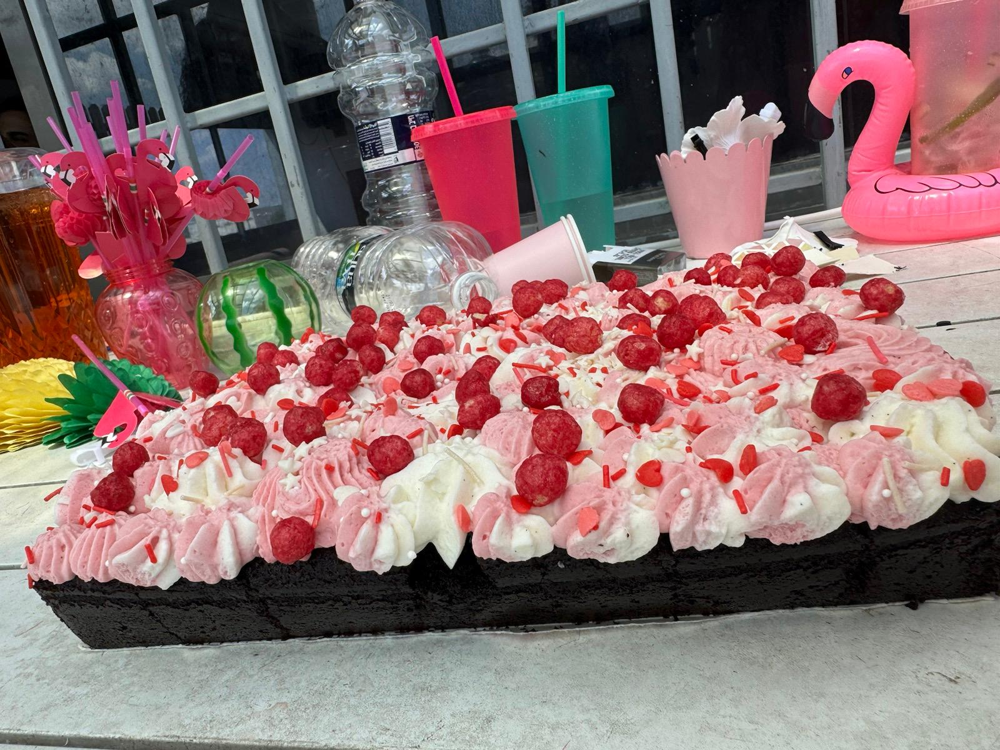
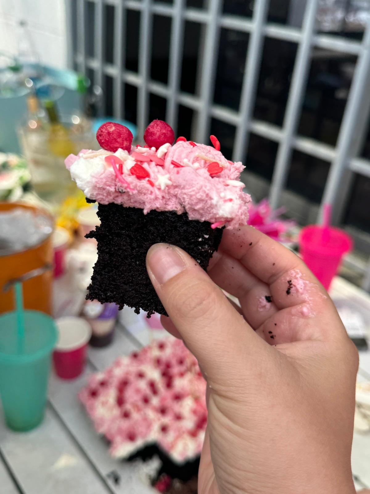

[חזרה לתפריט](../index.MD)

תבנית עגולה בקוטר 22 ס”מ

לעוגה:
3 ביצים L בטמפרטורת החדר  
200 גרם (1 כוס) סוכר  
קורט מלח  
125 מ”ל (1/2 כוס) שמן זית מעודן  
125 מ”ל (1/2 כוס) מים  
150 גרם (כוס וחצי) אבקת שקדים  
70 גרם (1/2 כוס) אבקת קקאו  
1/2 כפית סודה לשתייה  

לגנאש:
100 גרם שוקולד מריר  
125 מ”ל (1/2 מכל) שמנת מתוקה או קרם קוקוס  

לקישוט:
ברס (אגוזי לוז מקורמלים גרוסים)

אופן ההכנה:
מחממים תנור ל-160 מעלות (ללא טורבו) ומשמנים היטב את התבנית.  
בקערת מיקסר מקציפים ביצים, סוכר ומלח במהירות גבוהה עד שמתקבלת קציפה אוורירית, בהירה ותפוחה.  
מנמיכים את מהירות ההקצפה ומוסיפים פנימה את השמן בזרם דק תוך כדי ערבול אטי, עד שהוא נטמע בתערובת.  
מוסיפים את המים בזרם דק וממשיכים לערבל עד שהם נטמעים בתערובת.  
מוסיפים אבקת שקדים, קקאו וסודה לשתייה ומערבלים רק עד שאחיד.  
יוצקים את הבלילה לתבנית ואופים במשך 35-45 דקות או עד שהעוגה תופחת, מתייצבת בשוליים וקפיצית למגע.  
מצננים בטמפרטורת החדר. במהלך הצינון העוגה מעט שוקעת במרכז וזה בסדר.  
גנאש שוקולד: קוצצים את השוקולד ושמים בקערה.  
מוסיפים שמנת וממסים יחד במיקרוגל או על בן מארי עד שהכל נמס והתערובת אחידה.  
יוצקים את הגנאש על גבי העוגה ומניחים לו לנזול גם לדפנות.  
מצננים את העוגה במשך 2-3 שעות במקרר עד שהגנאש מתייצב לחלוטין.  
מחלצים מהתבנית ומקשטים בברס.  
מגישים את העוגה בטמפרטורת החדר.  
  

לחצי עוגה:  
1.5 ביצים L בטמפרטורת החדר 100 גרם ביצים טרופות  
100 גרם (חצי כוס) סוכר  
קורט מלח  
57 גרם (1/4 כוס) שמן זית מעודן  
63 גרם (1/4 כוס) מים  
75 גרם (שלושת רבעי כוס) אבקת שקדים  
35 גרם (1/4 כוס) אבקת קקאו  
1/4 כפית סודה לשתייה  

 ★ | ★ 
:--:|:--:
 | 
