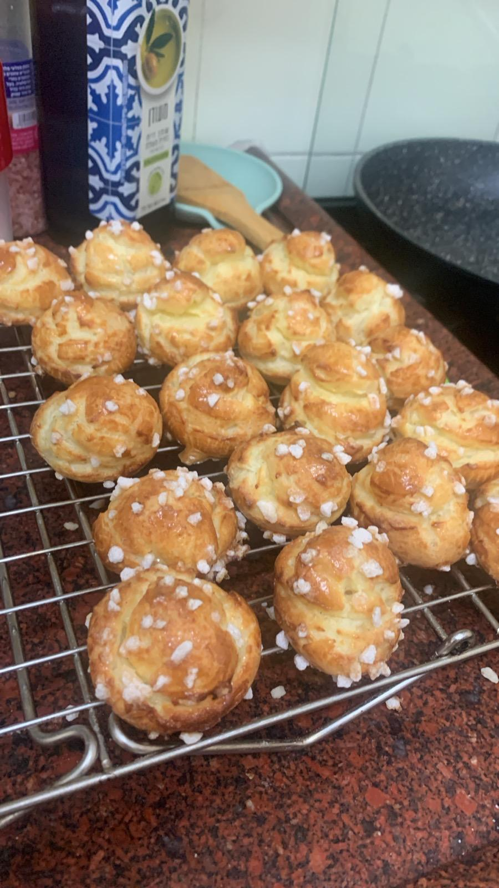

[חזרה לתפריט](../index.MD)

# שוקטים - Chouquettes

## מרכיבים x1 (מספיק 10-15 יחידות)
- 60 גרם חלב
- 16 גרם חמאה
- קורט קטן של מלח
- 30 גרם קמח רגיל
- ½ כפית תמצית וניל
- 1 ביצה גדולה

## מרכיבים x2 (מספיק ל-20-25 יחידות)
- 120 גרם חלב
- 32 גרם חמאה
- קורט בינוני של מלח
- 60 גרם קמח רגיל
- 1 כפית תמצית וניל
- 2 ביצים גדולות

## מרכיבים x3 (מספיק ל-30-40 יחידות)
- 180 גרם חלב
- 50 גרם חמאה
- קורט מלח
- 90 גרם קמח רגיל
- 1 כפית תמצית וניל
- 3 ביצים גדולות

## אופן הכנה
1. שמים חלב וחמאה בסיר קטן ומכינים את הקמח והמלח בקערה בצד.
2. מרתיחים את החלב והחמאה עד שמבעבעים, ומיד מכבים את האשמערבבים לתוך הסיר את הקמח עם כף עץ שטוחה עד שהתערובת הופכת לבצק גרגירי אך אחיד.
4. נותנים לתערובת להתקרר (כ-10 דקות במקפיא אם ממהרים).
5. מחממים תנור ל-180 מעלות טורבו.
6. מעבירים את הבצק למעבד מזון, מפעילים לכמה פולסים ומוסיפים תמצית וניל.
7. מוסיפים את הביצים אחת-אחת, ובין כל ביצה מעבדים את התערובת עד שהיא חלקה.
8. מעבירים לשקית זילוף ומזלפים על נייר אפייה עיגולים קטנים (הם מתנפחים מאוד, אז עדיף צורה עגולה ולא כמו נשיקה).
9. מפזרים סוכר גבישי בנדיבות מעל ומכניסים לתנור למשך 30-35 דקות, עד שהחלק העליון שחום.
