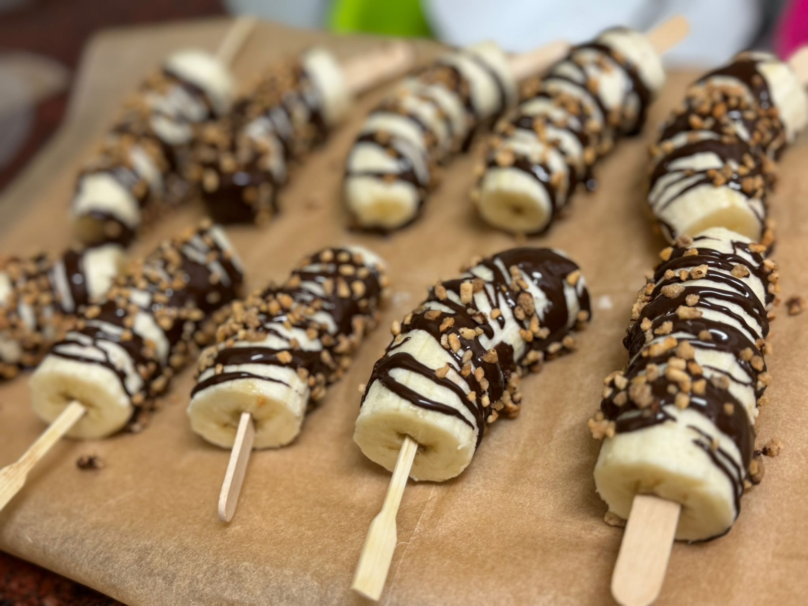

[חזרה לתפריט](../index.MD)

# "ארטיק" בננה שוקולד

## מרכיבים:
- בננות (חתוכות לחצאים או שלישים)
- שוקולד מריר (מומס)
- תוספות: אגוזי לוז מסוכרים, קוקוס קלוי, או סוכריות
- מקלות ארטיק קטנים

## הוראות הכנה:
1. ממיסים את השוקולד במיקרו.
2. תוקעים מקלות בבננות, מצפים בטיפטוף את הבננות ומוסיפים תוספות אבל טעים גם בלי.
3. מניחים על נייר אפייה ומקפיאים ל-30 דקות.
4. מעבירים לשקית ושומרים במקפיא.
