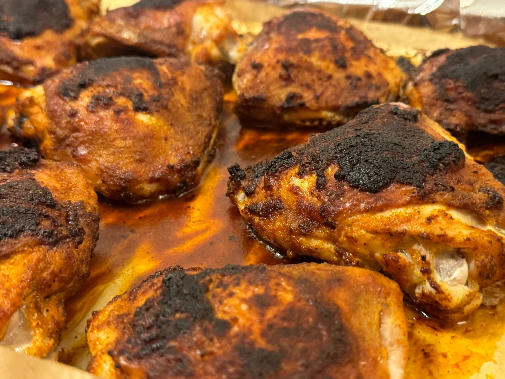

[חזרה לתפריט](../index.MD)

# ירכי עוף על הגריל

## מרכיבים בגרמים:
* 3 ק"ג ירכי עוף עם עור (הכמות המקסימלית שמתאימה לתבנית אפייה אחת).
* 30 גרם [תערובת תיבול לגריל](./grill_rub.MD)
* 36 גרם מלח (1.2%-1.3% ממשקל העוף)
* 10 גרם שמן זית

# הוראות
* מחממים את התנור ל-230°C (מדף אמצעי עם מאוורר).
* בקערה גדולה, מצפים היטב את ירכי העוף במלח ובתערובת התיבול.
* מרפדים תבנית אפייה בנייר אלומיניום, מניחים מעליו נייר אפייה, ומורחים שמן זית על נייר האפייה.
* מסדרים את ירכי העוף עם העור כלפי מטה על תבנית האפייה, עם מרווח בין הירכים בהתאם לגודל התבנית.
* אופים במשך 18 דקות, ואז מוציאים את התבנית ומפנים את כל החלקים. לאחר מכן, אופים במשך 15 דקות נוספות.

# הוראות לאחר הבישול
* יש לשמור את הנוזלים מהתבנית במיכל במקפיא.
  * השומנים ייפרדו, ניתן להשתמש בהם לטיגון ירקות כדי להוסיף טעם של עוף.
  * הנוזל החום הוא "זהב", ניתן להשתמש בו לתיבול כל דבר.
