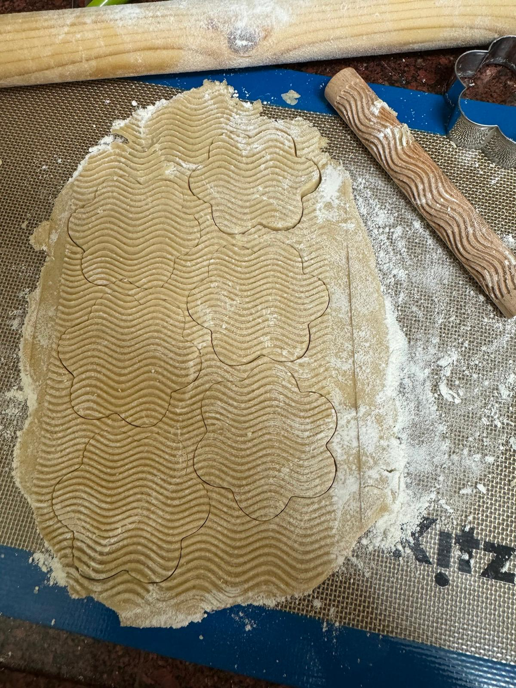
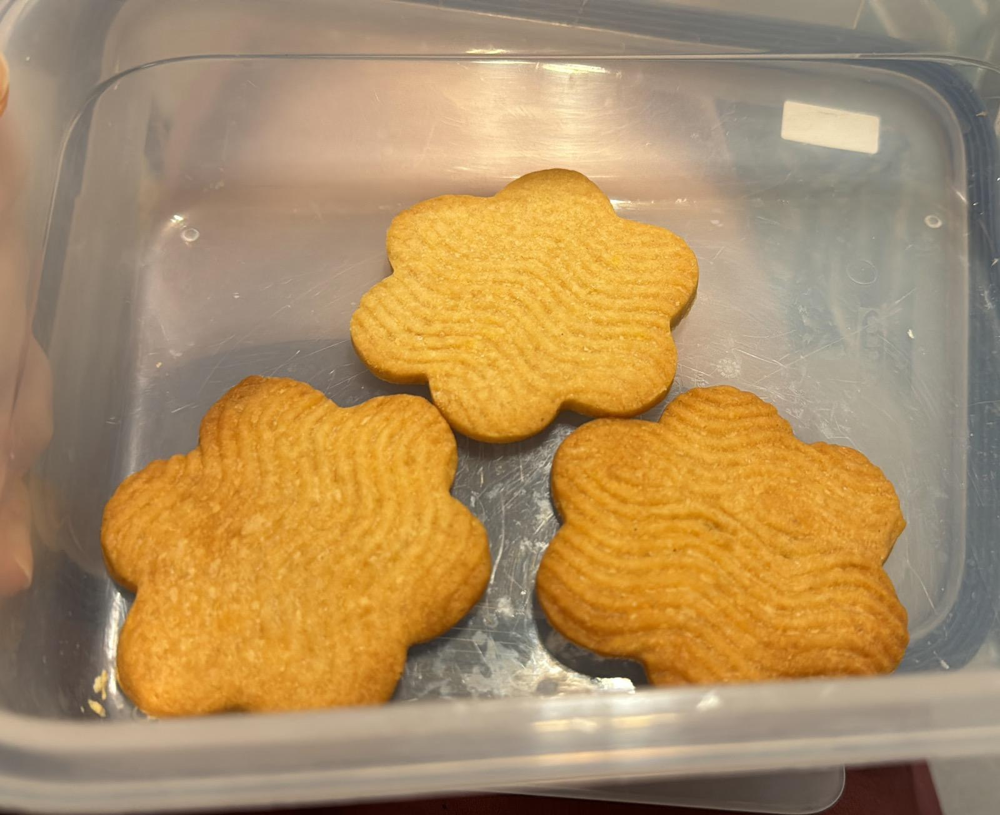

[חזרה לתפריט](../index.MD)

# עוגיות סוכר עם דבש

## מרכיבים:
- 227 גרם חמאה לא מלוחה, רכה
- 100 גרם סוכר
- 60 מ"ל דבש
- 5 מ"ל פסטת תרמיל וניל (ראה הערה)
- קמצוץ מלח
- 400 גרם קמח

## הוראות:
1. בקערת מיקסר , מקציפים חמאה וסוכר. מגרדים את הדפנות של הקערה.
2. מוסיפים דבש ותמצית וניל. מערבבים עד שהתערובת מתאחדת. מגרדים את הדפנות של הקערה.
3. מוסיפים את הקמח בהדרגה, ומערבבים רק עד שהתערובת מתחילה להתאחד.
4. יוצרים מהבצק דיסק, עוטפים בניילון נצמד ומניחים במקרר עד שהבצק מתייצב, לפחות שעה אחת.
5. מחממים תנור ל180 מעלות 
6. לאחר הקירור, מרדדים את הבצק לעובי של חצי סמ על משטח מקומח היטב. חותכים צורות רצויות ומניחים על תבניות האפייה המוכנות.
7. מקררים את הצורות החתוכות במקרר במשך 10 דקות לפני האפייה כדי לעזור לשמור על צורתן.
8. אופים במשך 7-10 דקות, או עד שהחלק התחתון מעט מזהיב. מניחים להתקרר בתבנית במשך לפחות 10 דקות לפני שמעבירים לרשת קירור להתקררות מוחלטת.

 ★ | ★ 
:--:|:--:
 | 
