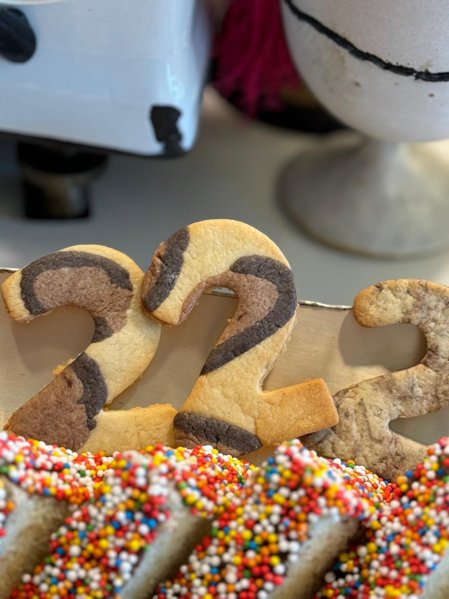
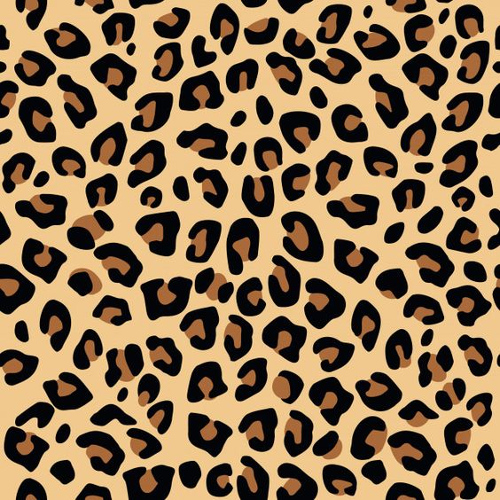

[חזרה לתפריט](../index.MD)

# עוגיות מנומרות

## מרכיבים:
- 100 גרם חמאה בקוביות
- ½ כוס סוכר קנים
- 1 חלמון שלם
- 1 כפית תמצית וניל
- 1¼ כוסות קמח כוסמין לבן
- ½ כפית אבקת אפייה
- 2 כפות חלב

### לחברבורות:
- 1 כפית אבקת קקאו
- 1 כפית קקאו שחור

## אופן הכנה:
1. במעבד מזון שמים את כל המרכיבים ומעבדים רק עד יצירת בצק אחיד.
2. מוציאים את הבצק ומפרישים ממנו שתי חתיכות קטנות בגודל כדור פינג פונג.
3. לאחת מוסיפים קקאו רגיל ולאחת קקאו שחור ומערבבים עד לצבע אחיד.
4. יוצרים מכל אחת מהן נחש באותו גודל. את הגליל הבהיר יותר משאירים כמו שהוא ואת הגליל הכהה עוטפים עד כחצי מהגליל הבהיר כדי לדמות חברבורת נמר (אפשר לראות דוגמה בתמונה).
5. מרדדים את הבצק הגדול ומסדרים עליו את החברבורות.
6. מניחים מעליו נייר אפייה ומרדדים בעדינות ביחד.
7. יוצרים עוגיות בעזרת קורצן ובעדינות מעבירים לתבנית.
8. אופים ב-170 מעלות במשך 10-12 דקות או עד שהן משחימות.

 ★ | ★ 
:--:|:--:
 | 
