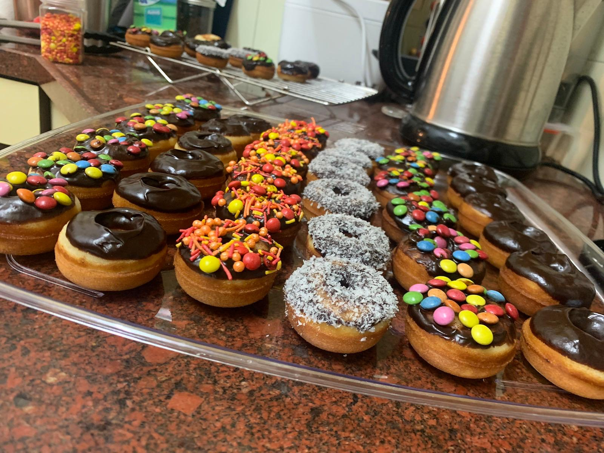
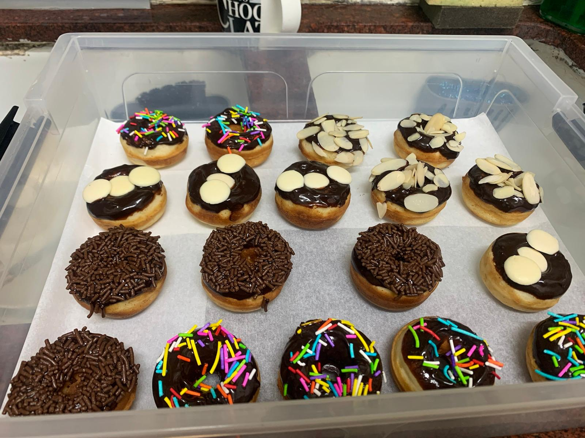

[חזרה לתפריט](../index.MD)

# בצק פנקייק

## מרכיבים
* 1 ביצה גדולה
* 180 גרם חלב
* 50 גרם סוכר גרגרים
* 50 גרם חמאה מומסת
* 1 כפית תמצית וניל
* 180 גרם קמח
* 1 כפית אבקת אפייה
* קמצוץ מלח

## להכנת סופגניה במולטיקייק
- אפייה במשך 5 דקות במולטיקייק
- מייצר 18 סופגניות

## ציפוי גנאש שוקולד
60 גרם שוקולד מריר לאפייה מומס במיקרוגל עם כמה כפות חלב

 ★ | ★ 
:--:|:--:
 | 
