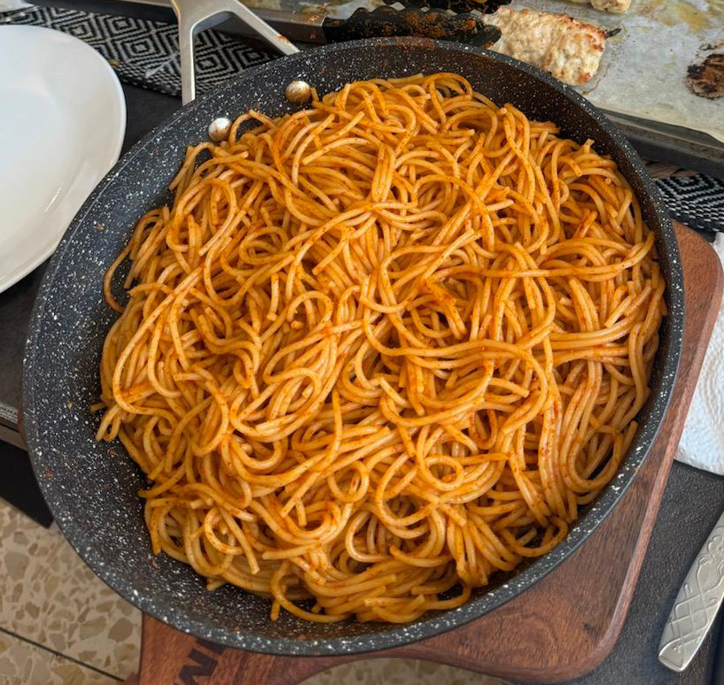

[חזרה לתפריט](../index.MD)

# פסטה פפריקש
## מרכיבים:
- חצי חבילה ספגטי (מומלץ פסטה דקה)
- שמן זית
- 2 כפות פפריקה מתוקה
- קופסת רסק עגבניות קטנה
- שום גבישי
- מלח ופלפל לפי הטעם
- פלפל קאיין או פפריקה חריפה (לא חובה)

## הוראות הכנה:
1. לבשל את הפסטה עד שהיא מוכנה, לסנן ולשים בצד.
2. לחמם מעט שמן זית בסיר.
3. להוסיף את הפפריקה המתוקה, רסק העגבניות, שום גבישי, מלח ופלפל. ניתן להוסיף פלפל קאיין או פפריקה חריפה לנגיעה של חריפות.
4. לערבב את התערובת כמה שניות בתחתית הסיר כדי לפתח את הטעמים.
5. להוסיף את הפסטה לסיר ולערבב היטב עם מלקחיים, עד שהפסטה מכוסה באופן אחיד ברוטב.
6. להשאיר את הפסטה בסיר לעוד כמה דקות כדי לקבל קצת טיגון, תוך כדי ערבוב.

## הערה:
לחבילה שלמה של פסטה יש להכפיל את כמות הפפריקה המתוקה, אך ניתן להישאר עם קופסה אחת של רסק עגבניות או להוסיף אחת נוספת למרקם סמיך יותר.

