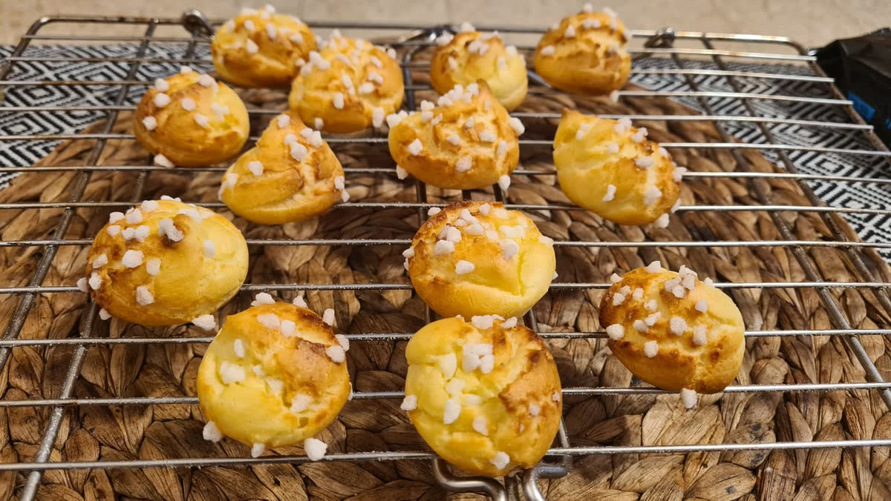

[חזרה לתפריט](../index.MD)

# בצק רבוך (Pâte à choux)

## מצרכים

- 60 גרם חלב
- 16 גרם חמאה
- קמצוץ קטן של מלח
- 30 גרם קמח לבן רגיל
- 1 ביצה גדולה

## מצרכים כפול 2

- 120 גרם חלב
- 32 גרם חמאה
- קמצוץ בינוני של מלח
- 60 גרם קמח לבן רגיל
- 2 ביצים גדולות

## מצרכים כפול 3

- 180 גרם חלב
- 50 גרם חמאה
- קורט מלח
- 90 גרם קמח לבן רגיל
- 3 ביצים גדולות

הביצה האחרונה עלולה להיות גדולה מדי. אפשר לטרוף אותה ולהוסיף בהדרגה, עד שמגיעים למרקם הבצק הרצוי.

