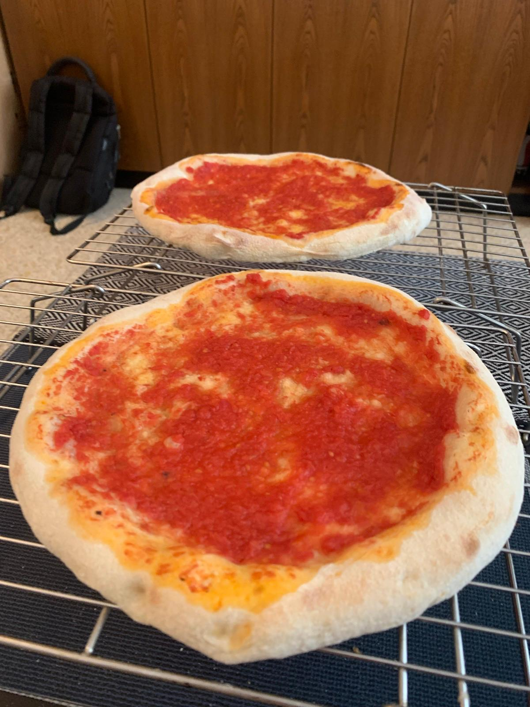
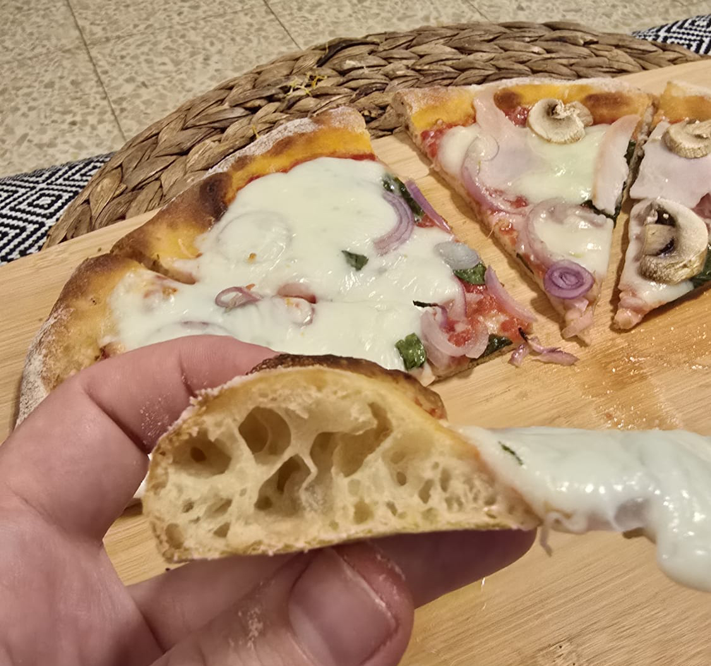

[חזרה לתפריט](../index.MD)

# מתכון לבצק פיצה
1. למרבה הצער, המחשבון המקורי אינו זמין [מחשבון פוליש](https://ggalmazor.com/bread_making/poolish_recipe_calculator.html)
2. למרבה המזל, העתקתי את הלוגיקה לסקריפט באש לפני שהוא ירד [סקריפט פוליש באש](../poolish_calc.sh)

## כללי

## מתכון ל-566 גרם בצק, 2 פיצות בקוטר 12 אינץ' כל אחת במשקל 283 גרם
משקל בצק רצוי: 566 גרם
הידרציה רצויה של הבצק: 70%

## פוליש
אחוז פוליש: 67%
אחוז הידרציה: 100%
אחוז שמרים בפוליש: 1.4%

## שאר הבצק
אחוז מלח: 2.7%
אחוז שמרים לשאר הבצק: 0%

## מרכיבים
סה"כ קמח: 333 גרם
סה"כ מים: 233 גרם

קמח לפוליש: 223 גרם
מים לפוליש: 223 גרם
שמרים לפוליש: 3 גרם
דבש לפוליש: 3 גרם

שאר הקמח: 110 גרם
שאר המים: 10 גרם
מלח: 9 גרם

## הוראות

### שיטת הפוליש של ויטו יאקופלי לפיצה נפוליטנית 

1. **הכנת הפוליש (לילה לפני)**:
 - ערבבו את מרכיבי הפוליש (קמח, מים, שמרים ודבש) עד לאיחוד מלא.
 - הניחו לתערובת לנוח בטמפרטורת החדר למשך שעה.
 - לאחר שעה, כסו והכניסו למקרר למשך הלילה (12-18 שעות).

2. **הכנת הבצק (ביום הבא)**:
 - ערבבו את הפוליש עם שאר הקמח, המים והמלח.
 - לושו את הבצק עד שהוא חלק ואלסטי, כ-10-15 דקות.
 - הניחו לבצק לנוח למשך 1-2 שעות בטמפרטורת החדר.

3. **חימום התנור**:
 - חממו את התנור לטמפרטורה הגבוהה ביותר עם אבן פיצה או פלדה בתוכו.
 - חממו לפחות שעה כדי להבטיח שהאבן או הפלדה חמים לחלוטין.

3. **עיצוב**:
 - חלקו ועצבו את הבצק לכדורים (כ-283 גרם כל אחד).
 - הניחו בקערות משומנות בשמן זית, כסו והניחו לנוח למשך 1-3 שעות בטמפרטורת החדר עד להכפלת הנפח.

4. **מתיחה**:
 - רוקנו כדור בצק אחד מהקערה המשומנת לקערה רחבה עם תערובת חצי-חצי של קמח 00 וסמולינה.
 - ודאו שהבצק מצופה היטב בתערובת הקמח.
 - הוציאו את כדור הבצק למשטח מקומח קלות ומתחו בעדינות לצורת פיצה בקוטר 12 אינץ'.
 - ודאו שהבצק לא דק מדי במרכז, והקצוות עבים מעט יותר.
 - התחילו מהמרכז ועבדו כלפי חוץ, והשאירו שוליים של 1 אינץ' מסביב.
 - עבדו עם אצבעות שטוחות כדי להימנע מלחיצה באצבע אחת על הבצק ויצירת חור.

5. **אפייה מוקדמת**:
 - פזרו מעט מתערובת הקמח על לוח הפיצה כדי למנוע הידבקות.
 - העבירו את הבצק המתוח ללוח הפיצה.
 - עבדו במהירות כדי למנוע מהבצק להידבק ללוח.
 - מרחו שכבה דקה (3-4 כפות) של רוטב עגבניות (עגבניות מרוסקות של מוטי עם מלח לפי הטעם וקצת שמן זית) על הבצק.
 - נערו בעדינות את הקלף כדי לוודא שהפיצה לא נדבקת.
 - החליקו את הפיצה על האבן או הפלדה המחוממת.
 - אפו את הפיצה לכמה דקות עד שהבצק מתייצב (אך לא מתחיל להשחים) ורוטב העגבניות מבושל חלקית (כ-4-5 דקות).

6. **תוספות ואפייה סופית**:
 - הוציאו את הפיצה מהתנור על רשת לקירור.
 - כאן תוכלו לשקול לאפות מראש כל בצק פיצה נוסף.
 - לאחת הפיצות האפויות מראש הוסיפו עלי בזיליקום, פרמזן מגורד, מוצרלה יבשה וכל תוספת אחרת.
 - לבצק כהה ופריך יותר, תוכלו לשקול להוסיף טפטוף שמן זית לשולי הפיצה.
 - החזירו את הפיצה לתנור ואפו עד שהגבינה נמסה והבצק משחים (כ-4-5 דקות נוספות).

7. **סיום**:
 - לאחר האפייה, הוציאו את הפיצה מהתנור, חזרה לרשת קירור, הניחו לה להתקרר מעט לפני ההגשה.

|            ★                    |              ★                      |
|:-------------------------------:|:-----------------------------------:|
|    |  |
|  |                                     |