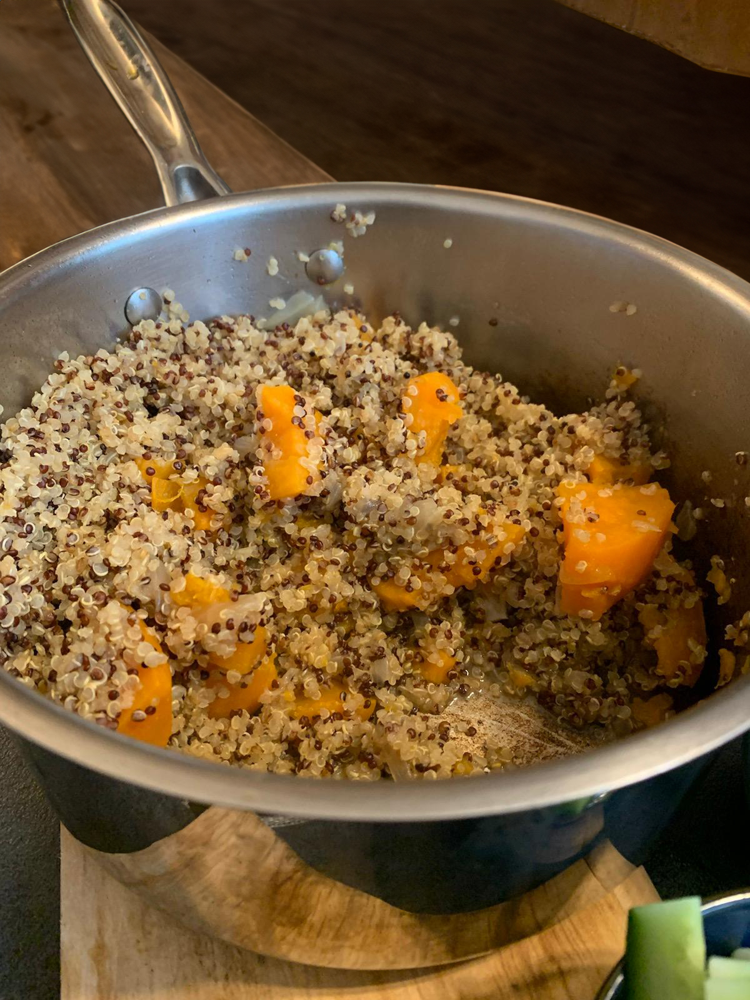

# קינואה טעימה עם בטטה
##  מצרכים
* שמן זית
* בצל
* קינואה
* בטטה
* מלח
* שום גבישי

## אופן הכנה
לקצוץ בצל ולטגן עד שמוכן
להוסיף את הקינואה ולערבב עם השמן והבצל כדי לצרוב מעט, להוסיף מלח(בערך שתי כפיות, הבטטה שותה את המלח) ושום גבישי(השום לא חובה)
לחתוך בטטות לפרוסות עבות ואת הפרוסות לרבעים ולערבב ביחד עם הכל
להוסיף כפול מים מכמות הקינואה ועוד רבע כוס בגלל הבטטות
להרתיח את הסיר, להוריד לאש קטנה ולכסות לרבע שעה, לאחר רבע שעה לכבות את האש ולהשאיר סגור ל10 דקות, לאחר מכן לפתוח ולערבב

