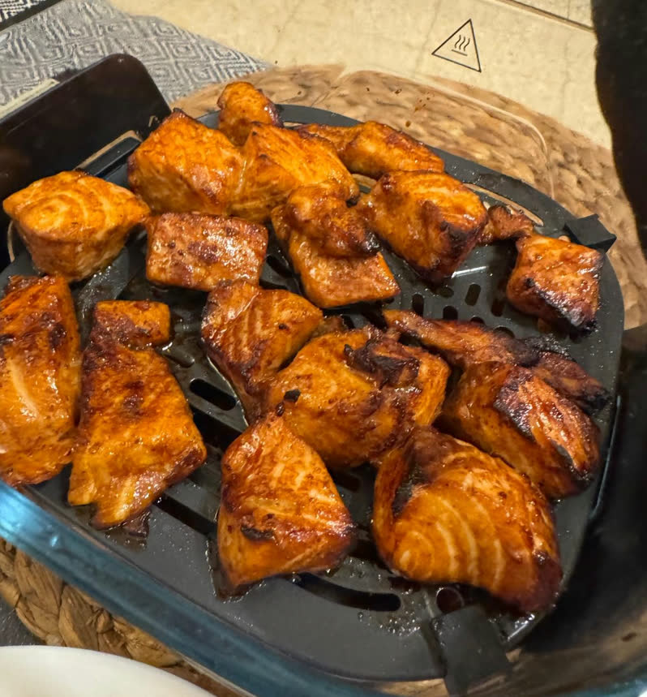

[חזרה לתפריט](../index.MD)

# סלמון טריאקי באייר פרייר

## מצרכים

- 350 גרם פילה סלמון ללא עור
- מלח, לפי הטעם
- פלפל שחור, לפי הטעם
- אבקת שום, לפי הטעם
- אבקת ג'ינג'ר, לפי הטעם
- 30 גרם רוטב סויה
- 30 גרם חומץ תפוחים
- 20 גרם דבש
- 1.5-2.5 גרם שמן שומשום

## הוראות הכנה

1. חותכים את הסלמון לקוביות אחידות בגודל 2-3 ס"מ, כדי שיתבשלו באותה רמת עשייה.
2. מעבירים את קוביות הסלמון לקערה ומתבלים במלח, פלפל, אבקת שום ואבקת ג'ינג'ר.
3. מוסיפים לאותה קערה את רוטב הסויה, חומץ התפוחים, הדבש ושמן השומשום, ומערבבים עד שהסלמון מצופה.
4. משרים את הסלמון בקערה 15 דקות.
5. מעבירים את הסלמון לנינג'ה קריספי או לאייר פרייר, בשכבה אחת.
6. 9 דקות, עד שהסלמון עשוי ומקורמל מעט.

אם מתכננים לשמור את הסלמון המוכן במקרר ולחמם אותו שוב במיקרוגל, כדאי לקצר מעט את זמן הבישול באייר פרייר.

