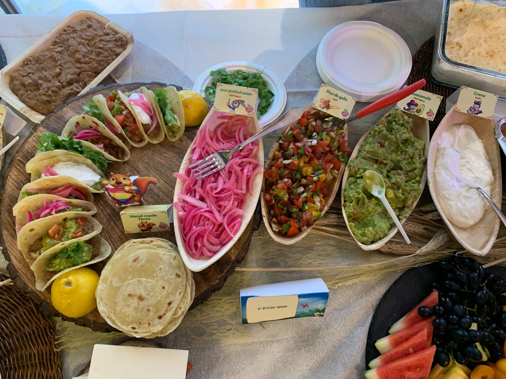

[חזרה לתפריט](../index.MD)

# טורטיות

## מרכיבים לפי אחוזי אפייה
* קמח לכל המטרות
* 50% לחות
* 15% שומן
* 2% מלח

## מרכיבים בגרמים:

* קמח לכל המטרות: 100 גרם
* מים (חמים, 30°C): 50 גרם
* שמן זית: 15 גרם
* מלח: 2 גרם
ל6 טורטיות
## הוראות:

* בקערת ערבוב, משלבים את הקמח, המלח ושמן הזית. מערבבים עד שהקמח מגיע למרקם חוליתי ומפורר (כדקה).
* מוסיפים את המים החמים לתערובת ומערבבים היטב עד שנוצר בצק מחוספס.
* לשים את הבצק במשך 4-5 דקות.
* מוסיפים טיפה של שמן לכלי נקי, מגלגלים את הבצק בשמן, מכסים ומניחים לנוח במשך 10 דקות.
* מחלקים את הבצק ל-25 גרם כל אחד ומגלגלים לכדורים, משרים מעט את הכדורים בשמן ומכסים, מניחים לנוח עוד 10 דקות.
* מטים כל כדור בקמח, מוודאים שכל הצדדים מצופים, ומקמחים קלות את השולחן ואת מערוך.
* לוחצים על הכדור לצורת דיסק, משפשפים את הצדדים כדי לדלל אותם לפני הרידוד כדי לעזור להשיג צורה עגולה.
* מרדדים את הבצק עם מערוך, מסובבים אותו ב-90 מעלות ומפנים אותו לעיתים קרובות. אם הבצק נעשה דביק, מקמחים אותו קלות משני הצדדים.
* מבשלים את הבצק המרודד על גריל בטמפרטורה בינונית במשך כ-90 שניות מצד אחד ו-30 שניות מצד שני.

