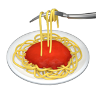
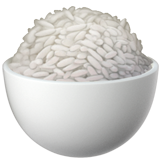
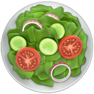
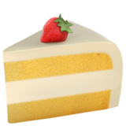
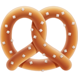

# תוכן עניינים | Table of Contents

🅥=Vegan ★=Our favorites!
 

    
    

| Hebrew (he)                                  | English (en)                                   |
|----------------------------------------------|------------------------------------------------|
| [קינואה](he/quinoa.MD) 🍚 🅥                 | [Quinoa](en/quinoa.MD) 🍚 🅥                   |
| [פאו דה קייז'ו](he/paodequeijo.MD) 🧀        | [Pão de Queijo](en/paodequeijo.MD) 🧀          |
| [בצק פיצה](he/pizza_dough.MD) 🍕             | [Pizza Dough](en/pizza_dough.MD) 🍕            |
| [תיבול לגריל](he/grill_rub.MD) 🌶️★ 🅥       | [Grill Rub](en/grill_rub.MD) 🌶️★ 🅥           |
| [טורטיות](he/tortillas.MD) 🌮🅥              | [Tortillas](en/tortillas.MD) 🌮 🅥             |
| [פסטה פפריקה](he/paprikesh_pasta.MD) 🍝★ 🅥  | [Paprikes pasta](en/paprikesh_pasta.MD) 🍝★ 🅥 |
| [בצק פילמני](he/pilmeni_dough.MD) 🥟         | [Pilmeni Dough](en/pilmeni_dough.MD) 🥟        |
| [גזר מוחמץ](he/quick_pickle_carrot.MD) 🥕 🅥 | [Quick Pickle Carrot](en/quick_pickle_carrot.MD) 🥕🅥 |

 
 

| Hebrew (he)                                       | English (en)                                              |
|---------------------------------------------------|-----------------------------------------------------------|
| [ירכי עוף בגריל](he/grilled_chicken_thighs.MD) 🍗 | [Grilled Chicken Thighs](en/grilled_chicken_thighs.MD) 🍗 |
| [קציצות עוף](he/chicken_meatballs.MD) 🐓★         | [Chicken meatballs](en/chicken_meatballs.MD) 🐓★          |
| [מרק עוף של סש](he/chicken_soup.MD) 🍲★           | [Sash's Chicken Soup](en/chicken_soup.MD) 🍲★             |
| חסר                                               | [shnitzel](en/shnitzel.MD)                                |
| חסר                                                | [borscht](en/borscht.MD)                                   |

 
 

| Hebrew (he)                                                   | English (en)                                                |
|---------------------------------------------------------------|-------------------------------------------------------------|
| [סלט כרוב סגול](he/purple_cabbage_salad.MD) 🥬🅥             | [Purple cabbage salad](en/purple_cabbage_salad.MD) 🥬🅥    |
| [סלט גזר](he/carrot_salad.MD) 🥕★🅥                    | [carrot salad](en/carrot_salad.MD) 🥕★🅥                   |

 
 

| Hebrew (he)                                                                | English (en)                                                                  |
|----------------------------------------------------------------------------|-------------------------------------------------------------------------------|
| [עוגיות שוקולד צ'יפס](he/chocolatechip_cookies.MD) 🍪★                     | [Chocolate Chip Cookies](en/chocolatechip_cookies.MD)🍪★                      |
| [עוגיות קוקוס ושקדים עם שוקולד](he/coconut_almond_choclate_cookies.MD)🍪🅥 | [Coconut Almond Chocolate Cookies](en/coconut_almond_choclate_cookies.MD)🍪🅥 |
| [עוגיות שוקולדצ׳יפ טבעוניות](he/choclatechip_vegan.MD) 🍪🅥                | [vegan chocolate chip cookies](en/choclatechip_vegan.MD) 🍪 🅥                |
| [עוגיות חמאה לחיתוך צורות](he/cookie_cutter_cookies.MD) 🍪                 | [Cookie Cutter Butter Cookies](en/cookie_cutter_cookies.MD) 🍪                |
| [עוגיות מנומרות](he/leopard_cookies.MD) 🐆                                 | [Leopard Cookies](en/leopard_cookies.MD)🐆                                    |
| [קאפקייקס וניל](he/vanila_cupcakes.MD) 🧁★                                 | [Vanilla Cupcakes](en/vanila_cupcakes.MD) 🧁★                                 |
| [שוקטים](he/chouquettes.MD) 🧈★                                            | [Chouquettes](en/chouquettes.MD) 🧈★                                          |
| [בלילת פנקייק](he/pankcakebatter.MD) 🥞                                    | [Pancake Batter](en/pankcakebatter.MD) 🥞                                     |
| [עוגת שוקולד](he/chocolate_cake.MD) 🥮                                     | [Chocolate Cake](en/chocolate_cake.MD) 🥮                                     |
| [עוגת בננה](he/banana_bread.MD) 🥮★                                        | [Banana Bread](en/banana_bread.MD) 🥮★                                        |
| [עוגיות דבש וסוכר](he/honey_sugar_cookies.MD) 🍯                           | [Honey Sugar Cookies](en/honey_sugar_cookies.MD) 🍯                           |
| [ארטיק בננה שוקולד](he/frozen_banana.MD) 🍌★🅥                             | [Frozen banana n' choclate](en/frozen_banana.MD) 🍌★🅥                        |
| חסר                                                                        | [crepe](en/crepe.MD)                                                          |

 
 

| Hebrew (he)                     | English (en)                          |
|---------------------------------|---------------------------------------|
| [קראקרים](he/crackers.MD) 🌰★🅥 | [Seed Crackers](en/crackers.MD) 🌰★🅥 |

