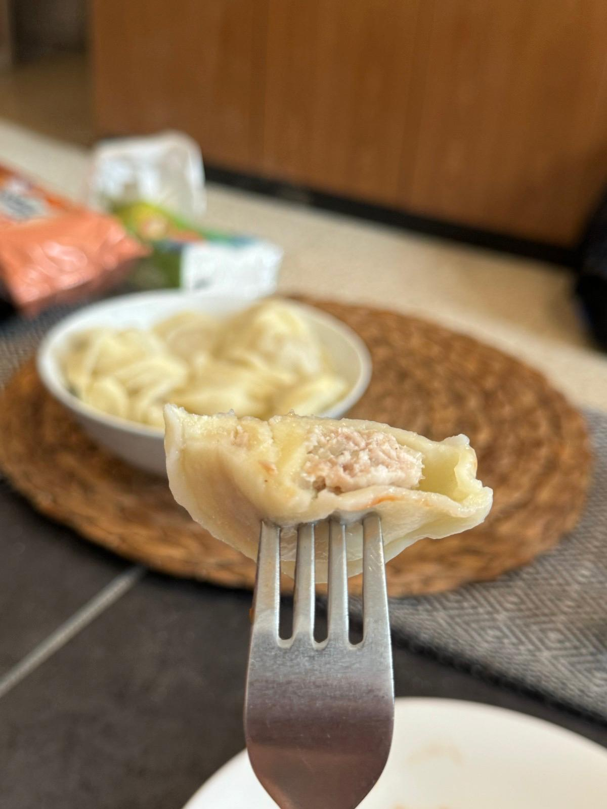

## Pelmeni Dough Recipe

### Ingredients
- 300g “00” pasta flour or bread flour
- 6g salt (2% of the flour weight)
- 1 egg
- 1 egg yolk
- Cold water (to complement wet ingrediants to 185g)

### Instructions
1. In a food processor, buzz the flour and salt for 10 seconds.
2. Weigh out wet ingrediants eggs, egg yolks, and enough cold water to reach a total weight of 185g.
3. Process until the dough forms.
4. Knead the dough by hand for 12 minutes.
5. If you don't have a food processor, use the well method to mix the ingredients.
6. Flour the dough, wrap it in plastic, and let it rest at room temperature for 30 minutes.

 ★ | ★ 
:--:|:--:
 | 