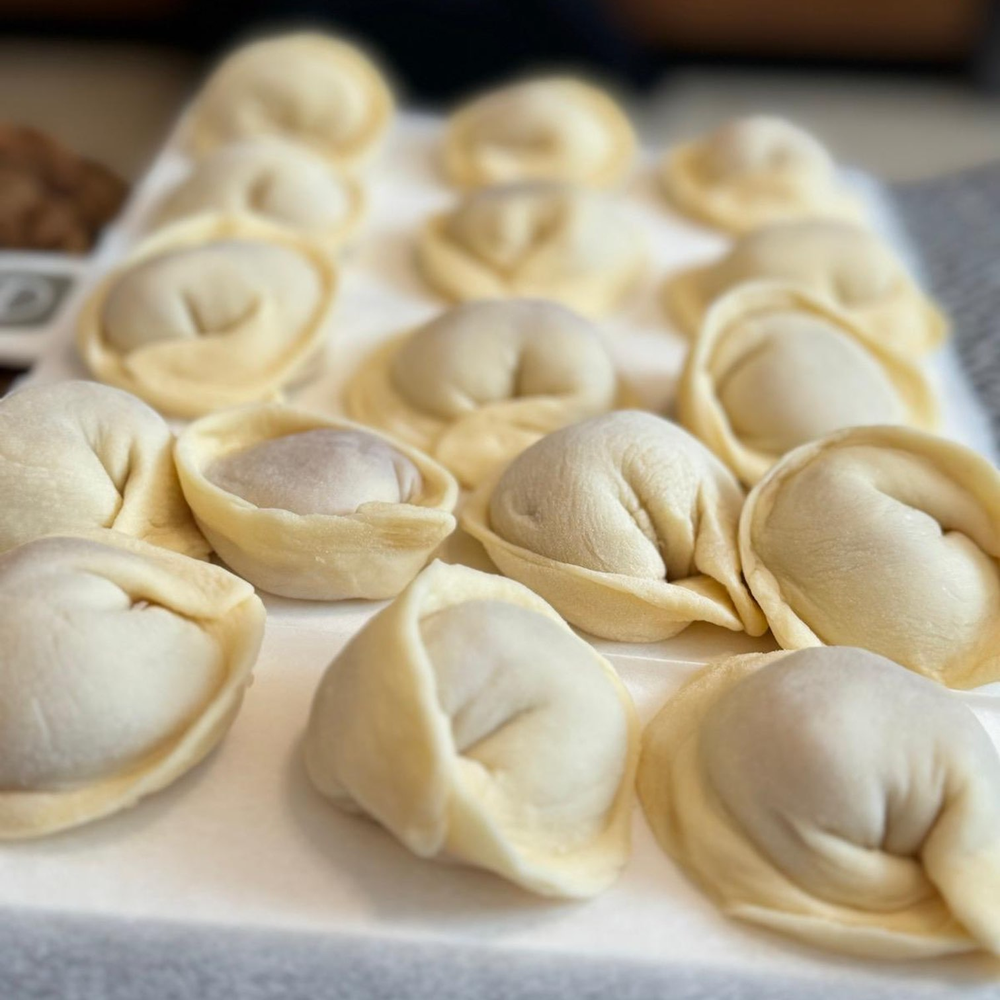
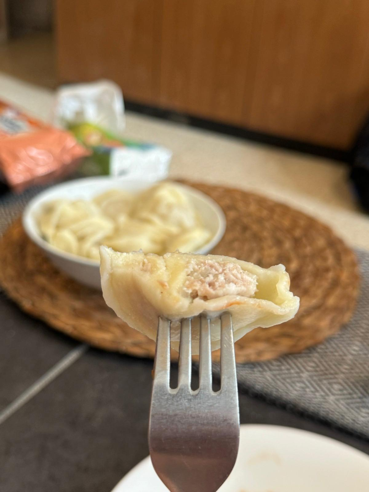

## מתכון לבצק פלמני

### מרכיבים

- 300 גרם קמח פסטה "00" או קמח לחם
- 6 גרם מלח (2% ממשקל הקמח)
- ביצה אחת
- חלמון אחד
- מים קרים (להשלים את המרכיבים הרטובים ל-185 גרם)

### הוראות

1. במעבד מזון, לערבב את הקמח והמלח ל-10 שניות.
2. לשקול את המרכיבים הרטובים (ביצים, חלמון ומים קרים) כך שסך הכל ישקול 185 גרם.
3. לעבד עד שהבצק נוצר.
4. ללוש את הבצק בידיים במשך 12 דקות.
5. אם אין מעבד מזון, להשתמש בשיטת הבאר לערבוב המרכיבים.
6. לקמח את הבצק, לעטוף בניילון ולהשאיר בטמפרטורת החדר למשך 30 דקות.
 ★ | ★ 
:--:|:--:
 | 